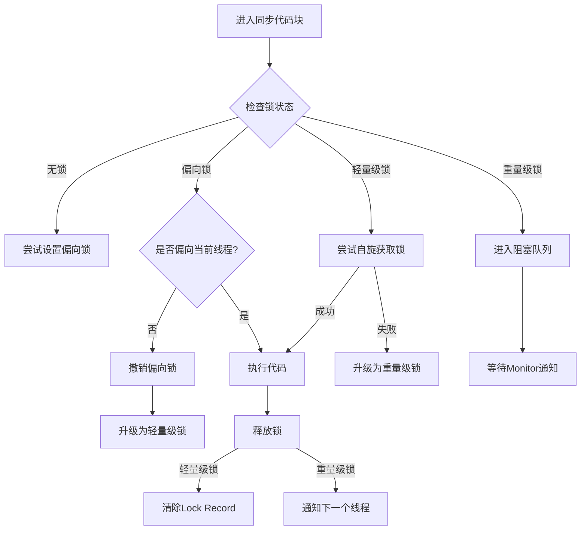
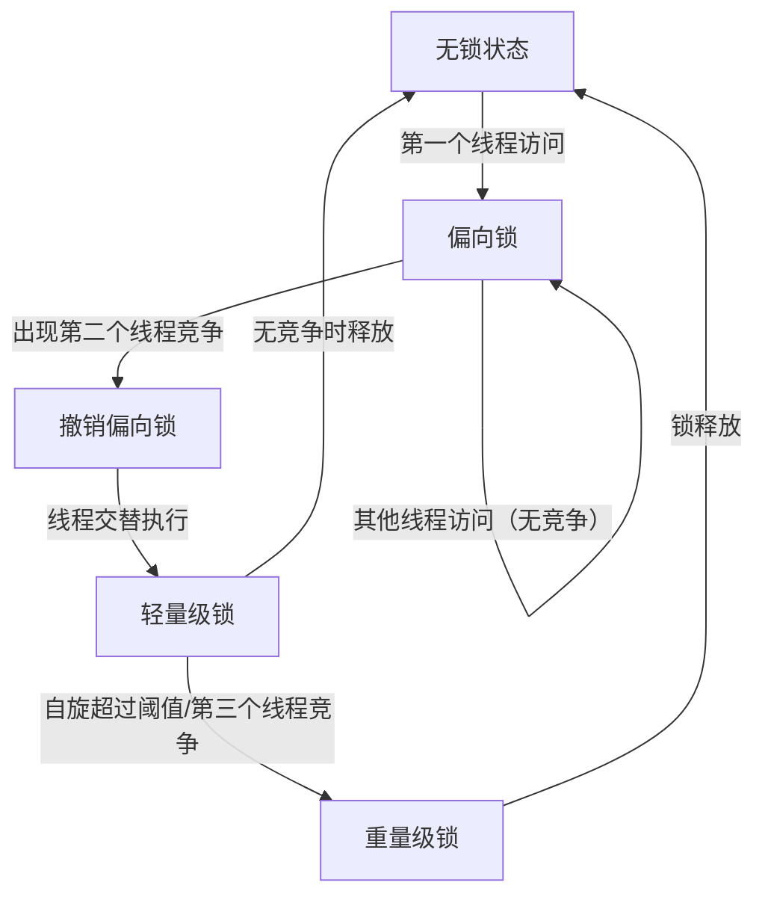
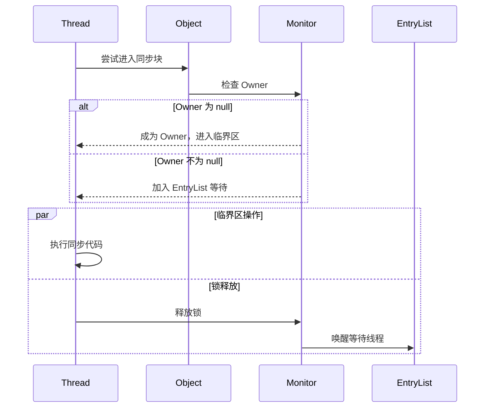
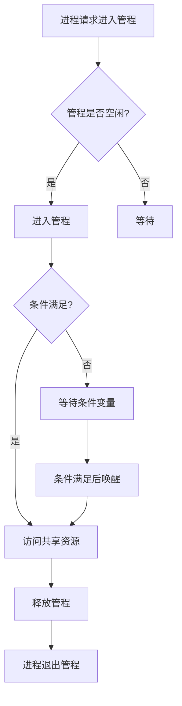
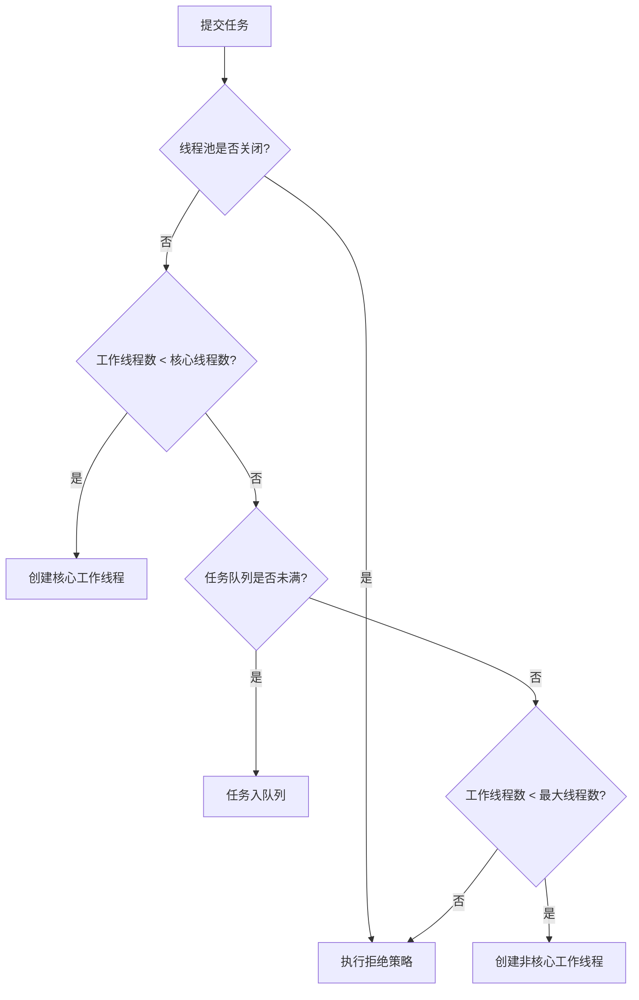
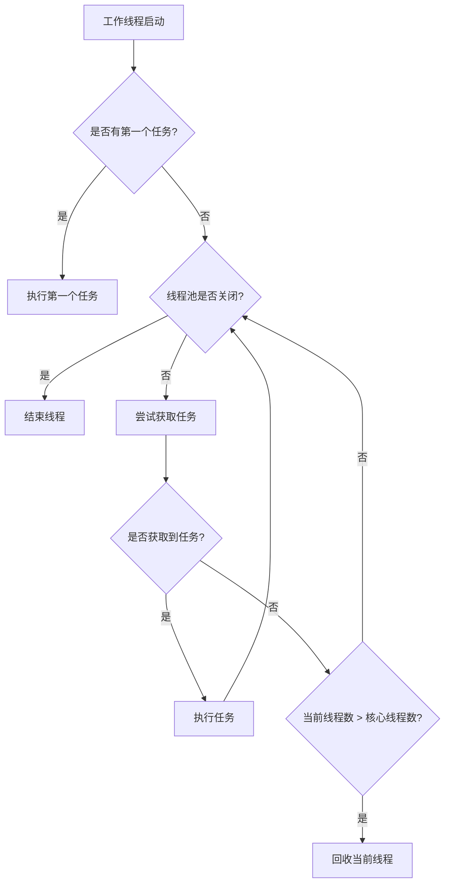

# 1 基本概念

**进程**是**资源分配**的**最小单位**，**线程**是**CPU调度**的**最小单位**。

# 2 线程创建

## 2.1 继承 Thread 类（重点）

1. 自定义线程类，**继承Thread类**
2. 重写run()方法，编写线程执行体
3. 在主函数中创建一个线程对象，调用start()方法开启线程。

```java
public class TestThread extends Thread {
    @Override
    public void run() {
        //run方法线程方法体
        for (int i = 0; i < 20; i++) {
            System.out.println("我在看代码----" + i);
        }
    }
    public static void main(String[] args) {
        //创建一个线程对象
        TestThread testThread = new TestThread();
		//start开启线程
        testThread.start();
        //主线程
        for (int i = 0; i < 200; i++) {
            System.out.println("我在学习多线程-----" + i);
        }
    }
}
```

## 2.2 实现Runnable接口（重点）

1. 自定义线程类，**实现Runnable接口**
2. 重写run()方法，编写线程执行体
3. 执行线程需要丢入runnable接口实现类，调用start()方法。

```java
public class TestThread2 implements Runnable {
    @Override
    public void run() {
        //run方法线程方法体
        for (int i = 0; i < 20; i++) {
            System.out.println("我在看代码----" + i);
        }
    }
    public static void main(String[] args) {
        //创建一个线程对象
        TestThread2 testThread2 = new TestThread2();
        //创建线程对象，通过线程对象来开启线程，代理
        new Thread(testThread2).start();
        //主线程
        for (int i = 0; i < 200; i++) {
            System.out.println("我在学习多线程-----" + i);
        }
    }
}
```

以上两种方式的比较：

继承 Thread 类

- 子类继承 Thread 类具备多线程能力
- 启动线程：子类对象 .start()
- 不建议使用：**避免 OOP 单继承局限性**
- 实现 Runnable 接口

**实现接口 Runnable**

- 具有多线程能力
- 启动线程：传入目标对象 + Thread对象.start()
- 推荐使用：**避免单继承局限性，方便同一个对象被多个线程使用。**

## 2.3 实现Callable接口

实现Callable接口，重写call方法。

1. **实现 Callable 接口，需要返回值类型**：class TestCallable implements Callable<Boolean>{}
2. **重写 call 方法，需要抛出异常**：public Boolean call()
3. **创建目标对象**：TestCallable testThread1 =  new TestCallable()
4. **创建执行服务**：ExecutorService service = Executor.newFixedThreadPool(4);
5. **提交执行**：Future<Boolean> result = ser.submit(testThread1);
6. **获取结果**：boolean r = result.get();
7. **关闭服务**：service.shutdownNow():

```java
public class TestCallable implements Callable<Boolean> {
    private String url;  //网络历经
    private String name;  // 保存的文件名
    public TestCallable(String url, String name) {
        this.name = name;
        this.url = url;
    }
    //下载图片线程的执行体
    @Override
    public Boolean call() {
        WebDownloader webDownloader = new WebDownloader();
        webDownloader.downloader(url, name);
        System.out.println("下载了文件名为：" + name);
        return true;
    }
    public static void main(String[] args) throws ExecutionException, InterruptedException {
        TestCallable testThread1 = new TestCallable("https://img-blog.csdnimg.cn/20210531145950543.png", "2.png");
        TestCallable testThread2 = new TestCallable("https://img-blog.csdnimg.cn/20210531145950543.png", "3.png");
        TestCallable testThread3 = new TestCallable("https://img-blog.csdnimg.cn/20210531145950543.png", "4.png");
        TestCallable testThread4 = new TestCallable("https://img-blog.csdnimg.cn/20210531145950543.png", "5.png");
        //创建执行服务:
        ExecutorService service = Executors.newFixedThreadPool(4);
        //提交执行:
        Future<Boolean> r1 = service.submit(testThread1);
        Future<Boolean> r2 = service.submit(testThread2);
        Future<Boolean> r3 = service.submit(testThread3);
        Future<Boolean> r4 = service.submit(testThread4);
        // 获取结果:
        boolean rs1 = r1.get();
        boolean rs2 = r2.get();
        boolean rs3 = r3.get();
        boolean rs4 = r4.get();
        //关闭服务:
        service.shutdownNow();

    }
    class WebDownloader {
        //下载方法
        public void downloader(String url, String name) {
            try {
                FileUtils.copyURLToFile(new URL(url), new File(name));
            } catch (IOException e) {
                e.printStackTrace();
                System.out.println("IO异常，downler方法出现问题");
            }
        }
    }
}
```

## 2.4 静态代理模式

### 2.4.1 Java 中动态代理与静态代理的本质区别

#### 1. 代理类的生成时机与方式
- **静态代理**  
  ⚙️ **编译时生成**：需手动编写代理类代码，代理类与被代理类实现同一接口。  
  📝 **显式调用**：在代理类中直接硬编码调用目标对象的方法。

- **动态代理**  
  ⚡ **运行时生成**：通过 `Proxy` 类和 `InvocationHandler` 接口动态创建代理对象。  
  🧬 **反射机制**：无需手动编写代理类，由 JVM 在内存中生成字节码。

---

#### 2. 代码维护性与灵活性
| **特性**     | 静态代理                         | 动态代理                                 |
| ------------ | -------------------------------- | ---------------------------------------- |
| **代码冗余** | 高（需为每个方法重复代理逻辑）   | 低（通过 `Invoke` 方法统一处理所有调用） |
| **扩展性**   | 差（每新增一个类需创建新代理类） | 强（一个处理器可代理多个接口/类）        |
| **适用场景** | 简单场景或需要精确控制个别方法   | AOP、日志、事务等横切关注点场景          |

---

#### 3. 接口依赖与实现方式
- **静态代理**  
  🔌 **支持两种模式**：  
  - 基于接口：代理类和目标类实现同一接口  
  - 基于继承：直接继承目标类（需覆写方法，但耦合度高）

- **动态代理（JDK 原生）**  
  🚫 **仅支持接口**：通过 `Proxy.newProxyInstance()` 代理接口方法。  
  💡 **第三方扩展**：CGLIB 库可通过继承方式代理无接口的类。

---

#### 4. 性能对比
| **维度**         | 静态代理               | 动态代理                 |
| ---------------- | ---------------------- | ------------------------ |
| **方法调用速度** | 快（直接调用无反射）   | 略慢（反射调用）         |
| **内存消耗**     | 低（编译时确定类结构） | 略高（运行时生成字节码） |
| **适用场景**     | 高性能敏感场景         | 灵活性与可维护性优先场景 |

---

### 2.4.2 代码示例对比

#### 静态代理实现
```java
// 接口
interface Database {
    void query(String sql);
}
// 目标类
class MySQL implements Database {
    public void query(String sql) {
        System.out.println("Executing: " + sql);
    }
}
// 静态代理类
class LogProxy implements Database {
    private MySQL mysql;    
    public LogProxy(MySQL mysql) {
        this.mysql = mysql;
    }    
    public void query(String sql) {
        System.out.println("[LOG] Start query: " + sql); // 手动添加日志
        mysql.query(sql);
        System.out.println("[LOG] End query");
    }
}
```

#### 动态代理实现

```java
import java.lang.reflect.*;

class LogHandler implements InvocationHandler {
    private Object target;    
    public LogHandler(Object target) {
        this.target = target;
    }    
    public Object invoke(Object proxy, Method method, Object[] args) throws Throwable {
        System.out.println("[LOG] Start method: " + method.getName());
        Object result = method.invoke(target, args); // 统一拦截所有方法
        System.out.println("[LOG] End method");
        return result;
    }
}
// 使用动态代理
Database mysql = new MySQL();
Database proxy = (Database) Proxy.newProxyInstance(
    mysql.getClass().getClassLoader(),
    new Class[]{Database.class},
    new LogHandler(mysql)
);
proxy.query("SELECT * FROM users");
```

### 2.4.3 本质区别总结

| **核心差异**     | 静态代理                 | 动态代理                       |
| :--------------- | :----------------------- | :----------------------------- |
| **设计哲学**     | 代码即约定（显式硬编码） | 运行时可编程（动态字节码增强） |
| **实现范式**     | 面向具体实现             | 面向抽象拦截                   |
| **设计模式演进** | 代理模式的传统实现       | 反射机制 + 代理模式的结合创新  |

# 3 多线程（重点）

## 3.1 线程状态及转换

线程的六种状态及转化

`java.lang.Thread.State`枚举类中定义了六种线程的状态，可以调用线程Thread中的`getState()`方法**获取当前线程的状态**。

| 线程状态      | 解释                                                         |
| :------------ | :----------------------------------------------------------- |
| NEW           | 尚未启动的线程状态，即线程创建，**还未调用start方法**        |
| RUNNABLE      | **就绪状态**（调用start，等待调度）+**正在运行**             |
| BLOCKED       | **等待监视器锁**时，陷入阻塞状态                             |
| WAITING       | 等待状态的线程正在**等待**另一线程执行特定的操作（如notify） |
| TIMED_WAITING | 具有**指定等待时间**的等待状态                               |
| TERMINATED    | 线程完成执行，**终止状态**                                   |


### 3.1.1 新建状态 (NEW)

即用**new关键字**新建一个线程，这个线程就处于**新建状态**。

### 3.1.2 运行状态 (RUNNABLE)

- 就绪状态（READY)

  java中**就绪和运行状态统一称为运行态**。当线程**调用 start() 方法**，线程就处于就绪态，此时**JVM中线程调度器**可以执行该线程。

  - 线程执行完成之后进入终止状态，所以不能再次使用start。

- 其他状态到运行状态

  - 线程调用start()，新建状态转化为就绪状态。
  - 线程sleep(long)时间到，等待状态转化为就绪状态。
  - 阻塞式IO操作结果返回，线程变为就绪状态。
  - 其他线程调用join()方法（**join方法保证线程有序执行**），结束之后转化为就绪状态。
  - 线程对象拿到对象锁之后，也会进入就绪状态。

- 运行状态 (RUNNING)

  就绪态线程获得CPU之后，便可以**执行run()方法**，此时处于运行状态。

- 运行状态转变为就绪状态

  - 线程失去处理器资源。
  - 调用yield()静态方法，当前线程愿意放弃当前对处理器的使用。这时，**当前线程将会被置为就绪状态**，和其他线程一样等待调度，这时候根据不同**优先级**决定的**概率**，当前线程完全有**可能再次抢到处理器资源**。

### 3.1.3 阻塞状态 (BLOCKED)

阻塞状态表示线程**正等待监视器锁**，而陷入的状态。

以下场景线程将会阻塞：

- 线程等待进入synchronized同步方法。
- 线程等待进入synchronized同步代码块。

线程取得锁，就会从阻塞状态转变为就绪状态。

### 3.1.4 等待状态 (WAITING)

进入该状态表示**当前线程需要等待其他线程做出一些的特定的动作**（通知或中断）。

**运行->等待**

- 当前线程运行过程中，其他线程调用`join`方法，当前线程将会进入等待状态。
- 当前线程对象调用`wait()`方法。
  -`LockSupport.park()`：出于线程调度的目的**禁用当前线程**。

**等待->就绪**

- 等待的线程**被其他线程对象唤醒**，`notify()`和`notifyAll()`。
- `LockSupport.unpark(Thread)`，与上面park方法对应，给出许可证，**解除等待状态**。

### 3.1.5 超时等待状态 (TIMED_WAITING)

区别于`WAITING`，它可以在**指定的时间**自行返回。

**运行->超时等待** 

- 调用静态方法，`Thread.sleep(long)`
- 线程对象调用`wait(long)`方法
- 其他线程调用指定时间的`join(long)`。
- `LockSupport.parkNanos()`。
- `LockSupport.parkUntil()`。

sleep和yield的不同之处：

- sleep(long)方法会**使线程转入超时等待状态**，时间到了之后才会转入就绪状态。而yield()方法不会将线程转入等待，而是强制线程进入就绪状态。
- 使用sleep(long)方法**需要处理异常**，而yield()不用。

**超时等待->就绪** 

- 同样的，等待的线程被其他线程对象唤醒，`notify()`和`notifyAll()`。
- `LockSupport.unpark(Thread)`。

### 3.1.6 终止状态 (TERMINATED)

即**线程的终止**，表示线程已经执行完毕。

## 3.2 守护线程（Daemon Threads）

守护线程（Daemon Thread）是Java中一种特殊的线程，主要用于**执行一些辅助任务**，如**垃圾回收、缓存管理等**。与普通线程（非守护线程）相比，守**护线程的特点是它会在所有非守护线程结束后自动关闭**。这意味着当应用程序中没有非守护线程在运行时，**JVM会自动关闭所有守护线程**。

```java
Thread daemonThread = new Thread(() -> {
    // 守护线程的代码逻辑
});
daemonThread.setDaemon(true);
daemonThread.start();
```

# 4 线程同步（重点）

线程同步指的是**线程之间“协同”**，即线程之间按照规定的先后次序运行。

经典的**超卖问题**和取款的**脏读问题**。

## 4.1 *synchronized* 同步方法以及同步块

Synchronized 是常被我们用来保证临界区以及临界资源安全的解决方案。它可以保证当有多个线程访问同一段代码，操作共享数据时，其他线程必须等待正在操作线程完成数据处理后再进行访问。即 Synchronized 可以达到线程互斥访问的目的。

Synchronized锁代表的锁机制有如下两种特性：互斥型和可见性。

- 互斥性：同一时间只允许一个线程持有某个对象锁，通过这种特性来实现多线程中并发安全；
- 可见性：确保锁在释放之前所做的操作，对之后的其他线程是可见的（即之后获取到该锁的线程获取到的共享变量是最新的）。



### 4.1.1 Synchronized对应的锁对象（重点）

理论上Java中所有的对象都可以作为锁，Java中根据synchronized使用的场景不同，其锁对象也是不一样的。

| 场景       | 具体分类 | 锁对象            | 代码示例                                          |
| ---------- | -------- | ----------------- | ------------------------------------------------- |
| 修饰方法   | 实例方法 | 当前实例对象      | public synchronized void method () { ... }        |
| 修饰方法   | 静态方法 | 当前类的Class对象 | public static synchronized void method () { ... } |
| 修饰代码块 | 代码块   | `( )`中配置的对象 | synchronized(object) { ... }                      |

在Java在JVM内存模型的堆中存储对象，每个对象都会存在对象头，对象头有**Mark Word 标记位**（分代年龄、锁状态、hashcode）和 **class pointer**（指向类元数据地址）。

当程序执行到同步代码块或者同步方法的时候，首先会去判断锁的状态，执行锁升级的流程。

（这里仅仅介绍重量锁）当遇到锁竞争激烈的时候，轻量锁会升级称为重量锁，每个对象都有可能会关联一个Monitor（因为Monitor是懒加载的，只有当锁升级为重量锁的时候才会创建Monitor）。在重量级锁状态下，Mark Word 的指针指向的是 Monitor 对象（ObjectMonitor），但具体位数与 JVM 实现相关（如 64 位系统会复用部分位）。

此时线程A访问同步代码块，通过对象头的 Monitor 指针找到关联的 ObjectMonitor，尝试通过 CAS 将 `owner` 字段设置为当前线程。失败则进入 EntryList 等待。

若当前线程已是 `owner`，`recursions++`，进行锁重入。

执行完毕后，退出同步块时，`recursions--`。当 `recursions == 0` 时，`owner` 置空，唤醒 EntryList 中的线程。

### 4.1.2 Monitor机制与Java对象头

#### 1 Monitor 是什么？

- 每个 Java 对象都关联一个 Monitor（管程/监视器）

- 实现线程互斥的核心机制

- 包含三个关键部分：

  | Owner         | 当前持有锁的线程           |
  | ------------- | -------------------------- |
  | **EntryList** | **等待锁的线程队列**       |
  | **WaitSet**   | **调用 wait() 的线程队列** |

#### 2 对象头与锁标记

```java
Object o = new Object();
synchronized(o) { /*...*/ } // 这里会修改 o 的对象头
```

- 对象内存结构：

  ```markdown
  |------------------------|------------------|----------------|
  |      Mark Word         |   Class Pointer  |  Instance Data |
  |------------------------|------------------|----------------|
  ```

- Mark Word 结构（64位系统）：

  

### 4.1.3 JVM 层面的实现

#### 1 字节码层面

查看编译后的字节码：

```
public void test();
  Code:
     0: aload_0
     1: getfield      #3  // 获取对象引用
     4: dup
     5: astore_1
     6: monitorenter   // 进入监视器
     7: aload_1
     8: monitorexit    // 正常退出
     9: goto  17
    12: astore_2
    13: aload_1
    14: monitorexit    // 异常退出
    15: aload_2
    16: athrow
    17: return
```

#### 2 锁升级过程



#### 3 不同锁状态的对比：

| 锁状态   | 优点             | 缺点            | 适用场景         |
| :------- | :--------------- | :-------------- | :--------------- |
| 偏向锁   | 加解锁无额外消耗 | 存在撤销开销    | 单线程访问       |
| 轻量级锁 | 线程交替执行     | 自旋消耗CPU     | 低竞争           |
| 重量级锁 | 不消耗CPU        | 线程阻塞/唤醒慢 | 高竞争、长临界区 |

### 4.1.4 Monitor 工作原理



#### 1 获取锁流程

1. 当线程执行到同步代码块
2. 检查 Owner 字段：
   - 为空：成为 Owner，进入临界区
   - 非空（不等于self）：进入 EntryList 等待

#### 2 释放锁流程

1. 将 Owner 置为 null
2. 唤醒 EntryList 中的线程（非公平竞争）

#### 3 wait/notify 机制


```java
synchronized(obj) {
    obj.wait();  // 进入 WaitSet
    obj.notify();// 随机唤醒一个 WaitSet 中的线程
}
```

### 4.1.5 重要特性解析

#### 1 可重入性

```java
public synchronized void a() {
    b(); // 可重入
}
public synchronized void b() {
    // 无需重新获取锁
}
```

- 实现原理：Monitor 中维护计数器（每次进入+1，退出-1）

#### 2 内存可见性

- 遵循 happens-before 原则
- 解锁前修改对后续加锁线程可见

## 4.2 死锁和Lock锁

产生死锁的四个必要条件：

1. 互斥条件：一个资源每次只能被一个进程使用。
2. 请求与保持条件：一个进程因请求资源而阻塞时，对已获得的资源保持不放。
3. 不剥夺条件：进程已获得的资源，在未使用完之前，不能强行剥夺。
4. 循环等待条件：若干进程之间形成一种头尾相接的循环等待资源关系。

上述四个条件，只要破坏其任意一个或多个条件就可避免死锁的发生。

从 JDK 5.0 开始，Java 提供了更强大的线程同步机制——通过显示定义同步锁对象来实现同步。同步锁使用 Lock对象充当java.util.concurrent.locks.Lock 接口是

ReentrantLock 类实现了 Lock ，它拥有与 synchronized 相同的并发性和内存语义，在实现线程安全的控制中，比较常用的是 ReentrantLock ，可以显示加锁释放锁。

**synchronized 与 Lock 的对比:**

- Lock 是显示锁（手动开启和关闭），synchronized 是隐式锁，出了作用域自动释放
- Lock 只有代码加锁，synchronized 有代码块锁和方法锁
- 使用 Lock 锁，JVM 将花费较少的时间来调度线程，性能更好。并具有更好的扩展性（提供更多的子类）
- Lock > 同步代码块（已经进入了方法体，分配了相应资源）>同步方法（在方法体之外）

# 5 线程通信（重点）

## 5.1 管程法

并发写作模型""生产者/消费者模式""–>管程法

- 生产者：负责生产数据的模块（可能是方法，对象，线程，进程）
- 消费者：负责处理数据的模块（可能是方法，对象，线程，进程）
- 缓冲区：消费者不能直接使用生产者的数据，他们之间有个缓冲区



### 5.1.1 缓冲区

需要定义一个容器SynContainer，这个容器类似于临界资源（各进程采取互斥的方式，实现共享的资源称作*临界资源*）。所以这个缓冲区需要具备的特点有：

1. 是生产者和消费者可见的。
2. 生产者的产品存入缓存（**队列**）。
3. 消费者消费缓存中的产品。
4. 缓冲区有大小，当处于边界的时候要阻塞所有消费者或者生产者。
5. 由于缓冲区是临界资源需要互斥访问（**synchronized同步方法**）。

```java
/**
 * 容器
 */
class SynContainer {
    // 创建一个容器
    private final int size;
    private final Queue<Chicken> chickens;
    public SynContainer() {
        chickens = new LinkedList<Chicken>();
        this.size = 4;
    }

    public SynContainer(int size) {
        chickens = new LinkedList<Chicken>();
        this.size = size;
    }
    // 生产者生产的产品存入容器
    public synchronized void push(Chicken chicken) {
        // 如果容器满了就阻塞等待消费者消费
        if (chickens.size() >= size) {
            try {
                this.wait();
            } catch (InterruptedException e) {
                throw new RuntimeException(e);
            }
        }
        // 如果没有满就将产品存入容器中。
        chickens.offer(chicken);
        // 如果消费者阻塞就唤醒，唤醒阻塞的消费者
        this.notifyAll();
    }

    // 消费者消费容器中的产品
    public synchronized Chicken pop() {
        // 如果容器是空的，消费者就阻塞
        if (chickens.isEmpty()) {
            try {
                this.wait();
            } catch (InterruptedException e) {
                throw new RuntimeException(e);
            }
        }
        // 取出容器中的产品
        Chicken chicken = chickens.poll();
        // 唤醒所有进程包括生产者
        this.notifyAll();
        return chicken;
    }
}
```

### 5.1.2 生产者

生产者负责生产产品，将产品存入缓冲区，生产者需要具备如下特性：

1. 持有缓冲区（通过构造函数传入）
2. 将产品放入缓冲区（使用push方法）

```java
/**
 * 生产者生产产品存入容器中
 */
class Producer implements Runnable {
    private final SynContainer synContainer;

    public Producer(SynContainer synContainer) {
        this.synContainer = synContainer;
    }

    @Override
    public void run() {
        for (int i = 0; i < 100; i ++ ) {
            synContainer.push(new Chicken(i));
            System.out.println("生产了" + i + "只鸡" );
        }
    }
}
```

### 5.1.3 消费者

消费者负责消费产品，将产品从缓冲区中取出，消费者需要具备如下特性：

1. 持有缓冲区（通过构造函数传入）
2. 将产品从缓冲区中取出（使用poll方法）

```java
/**
 * 消费者消费产品
 */
class Consumer implements Runnable {
    private SynContainer synContainer;

    public Consumer(SynContainer synContainer) {
        this.synContainer = synContainer;
    }

    @Override
    public void run() {
       for (int i = 0; i < 100; i ++ ) {
           Chicken chicken = synContainer.pop();
           System.out.println("消费了-->" + chicken.id + "只鸡");
       }
    }
}
```

### 5.1.4 主方法测试

```java
public class Monitor {
    public static void main(String[] args) {
        SynContainer synContainer = new SynContainer(10);
        new Thread(new Producer(synContainer)).start();
        new Thread(new Consumer(synContainer)).start();
    }
}
```

## 5.2 信号灯法

信号灯法，通过对标志位的改变实现线程之间的交互。

信号灯法不需要使用一个缓冲区对数据进行短暂的存储。即只能一个线程运行一次后就将资源交由另一个线程使用。

假设有A，B两个线程，设置一个标志位flag，当标志位flag=true时，运行线程A，线程B等待，反之运行线程B，线程A等待。

### 5.2.1 生产者代码详解

```java
class Actor implements Runnable {
    Programme programme;
    public Actor(Programme programme) {
        this.programme = programme;
    }

    @Override
    public void run() {
        for (int i = 1; i <= 20; i ++ ) {
            if (i % 3 == 0) {
                programme.action(i+": 来段青海摇");
            } else if (i % 3 == 1) {
                programme.action(i+": 宇将军飞踢");
            } else {
                programme.action(i+": java之父教学");
            }
        }
    }
}
```

生产者(Actor)负责生产节目:

- 实现了Runnable接口,可以作为线程执行。
- 构造函数接收一个Programme对象,用于调用action方法。
- run方法中循环20次,每次根据不同条件生产不同的节目。
- 通过调用programme.action()方法来"生产"节目。

### 5.2.2 消费者代码详解

```java
class Audience implements Runnable {
    Programme programme;
    public Audience(Programme programme) {
        this.programme = programme;
    }

    @Override
    public void run() {
        for (int i = 1; i <= 20; i ++ ) {
            programme.watch();
        }
    }
}
```

消费者(Audience)负责观看节目:

- 同样实现了Runnable接口。
- 构造函数接收Programme对象,用于调用watch方法。
- run方法中循环20次,每次调用programme.watch()方法来"消费"节目。

### 5.2.3 产品代码详解

```java
class Programme {
    String programmeName;  // 表演的节目
    boolean flag = true;

    public synchronized void action(String programmeName) {
        if (!flag) {
            try {
                this.wait();
            } catch (InterruptedException e) {
                throw new RuntimeException(e);
            }
        }
        this.programmeName = programmeName;
        System.out.println("演员表演了：" + programmeName);
        this.notify();
        this.flag = !this.flag;
    }

    public synchronized void watch() {
        if (flag) {
            try {
                this.wait();
            } catch (InterruptedException e) {
                throw new RuntimeException(e);
            }
        }
        System.out.println("观众观看了：" + this.programmeName);
        this.notify();
        this.flag = !this.flag;
    }
}
```

Programme类代表产品(节目):

- programmeName存储节目名称。
- flag作为信号灯,控制生产和消费的交替进行。
- action方法(生产

### 5.2.4 测试

```java
public class Semaphore {
    public static void main(String[] args) {
        Programme programme = new Programme();
        new Thread(new Actor(programme)).start();
        new Thread(new Audience(programme)).start();
    }
}
```

# 6 手写线程池（重点）

## 6.1 线程池概述

这顾名思义，线程池就是管理一系列线程的资源池，其提供了一种限制和管理线程资源的方式。每个线程池还维护一些基本统计信息，例如已完成任务的数量。

1  线程池的好处：

- **降低资源消耗**。通过重复利用已创建的线程降低线程创建和销毁造成的消耗。
- **提高响应速度**。当任务到达时，任务可以不需要等到线程创建就能立即执行。
- **提高线程的可管理性**。线程是稀缺资源，如果无限制的创建，不仅会消耗系统资源，还会降低系统的稳定性，使用线程池可以进行统一的分配，调优和监控。

2  <font color="red">**线程池为什么好，速度为什么快，资源消耗为什么少？**</font>

**因为线程需要创建结束后需要销毁，而线程池实现线程复用，因为线程创建和销毁会消耗大量资源，在执行了完成一个任务后，线程不会马上销毁，而是会不断的获取新的任务执行。**

- 线程复用**减少了线程创建和销毁的开销**，避免了频繁创建和销毁线程带来的系统资源消耗，任务可以快速被执行,无需等待线程创建。
- 可以**限制并发线程数**，防止资源过度消耗，提供了线程管理、调度和监控的机制
- 核心线程**随时待命**,可以立即执行任务，无需等待线程创建的时间
- **避免了**创建大量线程导致的**系统崩溃**，线程异常可以被捕获和处理,不会影响其他任务
- 可以灵活配置线程池参数以适应不同场景，**提供了**不同的**任务队列策略和拒绝策略**

3  **手写线程池整体架构**，该线程池实现包含以下核心组件：

- **BlockingQueue**：基于双端队列的阻塞队列，支持超时等待
- **ThreadPool**：线程池主体，包含线程管理、任务调度逻辑
- **Worker**：工作线程实现类
- **RejectPolicy**：拒绝策略接口
- **测试用例**：包含生产者-消费者和演员-观众两组演示案例

### 6.1.1 **创建工作线程流程图**

1. **提交任务**
   用户调用 `execute(Runnable task)` 提交任务到线程池。
2. **检查线程池状态**
   - 如果线程池已关闭（`isShutdown` 为 `true`），直接执行拒绝策略（如日志记录、抛出异常等）。
   - 如果线程池正常运行，进入下一步。
3. **判断核心线程数**
   - 如果当前工作线程数 `<` 核心线程数（`corePoolSize`），**创建核心线程**（`Worker` 对象），并立即执行任务。
   - 否则，尝试将任务加入任务队列。
4. **任务队列缓冲**
   - 如果任务队列未满，任务会被加入队列等待执行。
   - 如果队列已满，检查当前工作线程数是否 `<` 最大线程数（`maximumPoolSize`）。
5. **创建非核心线程**
   - 如果未达到最大线程数，**创建非核心线程**（临时线程），执行当前任务。
   - 如果已超过最大线程数，执行拒绝策略。

**关键逻辑**

- **同步控制**：在判断工作线程数和操作 `workers` 集合时，通过 `synchronized(workers)` 保证线程安全。
- **任务队列的双层缓冲**：优先使用核心线程，队列作为缓冲层，最后才创建非核心线程。
- **拒绝策略**：用户可自定义拒绝行为（如代码中的 `RejectPolicy` 接口）。



### 6.1.2 **工作线程执行任务流程图**

1. **线程启动**
   - 工作线程（`Worker`）启动后，优先执行其绑定的第一个任务（`firstTask`）。
2. **循环获取任务**
   - 第一个任务执行完成后，进入循环流程：
     1. **检查线程池状态**
        - 如果线程池已关闭，直接结束线程。
        - 否则，尝试从任务队列中获取任务（`poll` 方法）。
3. **任务获取结果**
   - **获取到任务**：立即执行任务。
   - **未获取到任务**（超时或队列为空）：
     - 检查当前工作线程数是否 `>` 核心线程数。
     - 如果是，**回收当前线程**（从 `workers` 集合中移除并结束线程）。
     - 否则，继续等待新任务。
4. **任务执行与循环**
   - 每次任务执行完成后，重新检查线程池状态并尝试获取新任务。

**关键逻辑**

- **超时机制**：非核心线程通过 `taskQueue.poll(keepAliveTime, timeUnit)` 实现空闲超时回收。
- **线程自我回收**：非核心线程在空闲超时后主动释放资源，而核心线程会永久保留（除非线程池关闭）。
- **关闭响应**：线程池关闭时，通过设置 `isShutdown` 标志并唤醒所有等待线程，快速终止工作线程。



### 6.1.3 **总结**

- **核心设计**：通过核心线程、任务队列、非核心线程的三级调度，平衡资源利用率和响应速度。
- **弹性伸缩**：非核心线程按需创建，空闲时自动回收，避免资源浪费。
- **安全关闭**：通过标志位传播关闭状态，确保线程池和任务队列协同终止。

## 6.2 核心组件详解

### 6.2.1 BlockingQueue（任务队列）

```java
class BlockingQueue<T> {
    private final Deque<T> deque; // 双端队列存储元素
    private final ReentrantLock lock; // 可重入锁
    private final Condition fullWaitSet; // 队列满等待条件
    private final Condition emptyWaitSet; // 队列空等待条件
    private final int capacity; // 队列容量
    private volatile boolean isShutdown = false; // 关闭状态
}
```

**关键方法分析**：

- `poll(long timeout, TimeUnit unit)`：
  - 带超时时间的出队操作
  - 使用`awaitNanos()`实现精确的纳秒级等待
  - 唤醒条件：队列非空或线程池关闭
- `put(T task)`：
  - 阻塞式入队操作
  - 当队列满时通过`fullWaitSet.await()`挂起线程
  - 入队后通过`emptyWaitSet.signal()`唤醒消费者
- `shutdown()`：
  - 设置关闭标志
  - 唤醒所有等待线程实现快速关闭

poll方法在队列为空的时候不断循环，尝试取数据，有数据的时候就返回，且有超时限制，如果超时了就返回空。<font color="red">emptyWaitSet.awaitNanos(nanos) 将当前线程进入等待状态**TIMED_WAITING**，最多等待nanos纳秒，注意可能线程会被提前唤醒，所以这个函数的返回值是剩余时间</font>。

```java
public T poll(long timeout, TimeUnit unit) throws InterruptedException {
    long nanos = unit.toNanos(timeout);
    lock.lockInterruptibly();
    try {
        while (deque.isEmpty() && !isShutdown) {
            if (nanos <= 0) return null;
            nanos = emptyWaitSet.awaitNanos(nanos);
        }
        return isShutdown ? null : deque.removeFirst();
    } finally {
        lock.unlock();
    }
}
```

**take方法类似于poll方法，但是是无限制的阻塞。**

offer方法，添加元素到阻塞队列中，如果**阻塞队列满了或者线程池关闭了**就拒绝任务。每次来了新任务都需要唤醒由于执行poll或者take方法进入等待状态的线程。

**<font color="red">注意点：emptyWaitSet是Condition对象，Condition对象内部会有一个等待队列，当调用wait方法时，线程会被放入该队列。当调用signal方法时会被唤醒。</font>**

```java
public boolean offer(T task) {
    lock.lock();
    try {
        if (isShutdown || deque.size() == capacity) return false;
        deque.addLast(task);
        emptyWaitSet.signalAll();
        return true;
    } finally {
        lock.unlock();
    }
}
```

**put不同于offer**，当队列满了offer方法会直接返回false。然而put方法会让该线程进入等待状态。

```java
public void put(T task) throws InterruptedException {
    lock.lockInterruptibly();
    try {
        while (deque.size() == capacity && !isShutdown) {
            fullWaitSet.await();
        }
        if (isShutdown) return;
        deque.addLast(task);
        emptyWaitSet.signalAll();
    } finally {
        lock.unlock();
    }
}
```

**shutdown会让isShutdown=true然后唤醒所有被阻塞的线程，然后再循环条件 !isShutdown 判断不通过退出循环从而结束线程池中的线程。**

```java
public void shutdown() {
    lock.lock();
    try {
        isShutdown = true;
        fullWaitSet.signalAll();
        emptyWaitSet.signalAll();
    } finally {
        lock.unlock();
    }
}
```

### 6.2.2 ThreadPool（线程池类）

ThreadPool类是线程池的核心实现，包含以下重要属性和方法：

- taskQueue: 用于存储待执行的任务
- workers: 存储工作线程
- corePoolSize和maximumPoolSize: 控制线程池大小
- keepAliveTime和timeUnit: 控制非核心线程的空闲时间
- rejectPolicy: 任务拒绝策略
- execute方法: 提交任务到线程池
- shutdown方法: 关闭线程池

**queueCapacity是构造方法传入参数，用于初始化任务队列的大小，任务队列是阻塞队列。**

execute 方法首先会判断线程池是否关闭，关闭了之后到来的任务task，execute方法调用rejectPolicy拒绝策略进行拒接。

为了确保线程安全，**会对workers工作线程集合进行互斥访问**。当新到来一个任务时，如果工作线程个数小于corePoolSize会创建新的工作线程，否则复用以创建的工作线程。

**如果添加任务失败了（任务执行队列满了）就会试图创建一个新的工作线程执行该任务（缓解任务过多，提供一定的弹性）。**

如果都失败了，就会采用**拒绝策略处理任务**。

```java
public void execute(Runnable task) {
        if (isShutdown) {
            rejectPolicy.reject(taskQueue, task);
            return;
        }
        synchronized (workers) {
            // 创建核心线程
            if (workers.size() < corePoolSize) {
                Worker worker = new Worker(task);
                workers.add(worker);
                worker.start();
            }
            // 尝试入队
            else if (taskQueue.offer(task)) {
                // 任务已加入队列
            }
            // 创建非核心线程
            else if (workers.size() < maximumPoolSize) {
                Worker worker = new Worker(task);
                workers.add(worker);
                worker.start();
            }
            // 执行拒绝策略
            else {
                rejectPolicy.reject(taskQueue, task);
            }
        }
    }
```

shutdown方法是关闭线程池，将isShutdown变成true，通过关闭任务队列（任务队列会不断轮询阻塞获取）

```java
public void shutdown() {
        synchronized (workers) {
            isShutdown = true;
//            for (Worker worker : workers) {
//                worker.interrupt();
//            }
        }
        taskQueue.shutdown();
    }
```

**线程池的完整实现。**

```java
class ThreadPool {
    private final BlockingQueue<Runnable> taskQueue;
    private final HashSet<Worker> workers = new HashSet<>();
    private final int corePoolSize;
    private final int maximumPoolSize;
    private final long keepAliveTime;
    private final TimeUnit timeUnit;
    private final RejectPolicy<Runnable> rejectPolicy;
    private volatile boolean isShutdown = false;

    public ThreadPool(int corePoolSize, int maximumPoolSize,
                      long keepAliveTime, TimeUnit timeUnit,
                      int queueCapacity, RejectPolicy<Runnable> rejectPolicy) {
        this.corePoolSize = corePoolSize;
        this.maximumPoolSize = maximumPoolSize;
        this.keepAliveTime = keepAliveTime;
        this.timeUnit = timeUnit;
        this.taskQueue = new BlockingQueue<>(queueCapacity);
        this.rejectPolicy = rejectPolicy;
    }

    public void execute(Runnable task) { ... }

    public void shutdown() { ... }

    private class Worker extends Thread { ... }
}
```

### 6.2.3 Worker（工作线程实现类）

**Worker是线程池类中的内部类。**

**ThreadPool线程池中需要一个集合workers来存储工作线程Worker**，这个工作线程集合workers它的最大容量不超过corePoolSize（在代码中还是给了一个扩容的上限maximumPoolSize）

**这个工作线程不断的循环取出任务队列中的任务执行**，通过线程池中会提供一个maximumPoolSize，**提供一定的弹性也就是任务最多不超过maximumPoolSize大小**，应对任务过多导致的频繁阻塞等待。

**当任务队列空闲的时候**，**会销毁多出来的工作线程**。

```java
private class Worker extends Thread {
    private Runnable firstTask;
    Worker(Runnable firstTask) {
        this.firstTask = firstTask;
    }
    @Override
    public void run() {
        try {
            // 执行第一个任务
            if (firstTask != null) {
                firstTask.run();
                firstTask = null;
            }
            // 循环获取任务
            while (!isShutdown) {
                Runnable task = taskQueue.poll(keepAliveTime, timeUnit);
                if (task != null) {
                    task.run();
                } else {
                    // 检查是否需要回收线程
                    synchronized (workers) {
                        if (workers.size() > corePoolSize) {
                            workers.remove(this);
                            break;
                        }
                    }
                }
            }
        } catch (InterruptedException e) {
            // 响应中断
        } finally {
            synchronized (workers) {
                workers.remove(this);
            }
        }
    }
}
```