[TOC]

# 1 基本概念

**进程**是**资源分配**的**最小单位**，**线程**是**CPU调度**的**最小单位**。

# 2 线程创建

## 2.1 继承 Thread 类（重点）

1. 自定义线程类，**继承Thread类**
2. 重写run()方法，编写线程执行体
3. 在主函数中创建一个线程对象，调用start()方法开启线程。

```java
public class TestThread extends Thread {
    @Override
    public void run() {
        //run方法线程方法体
        for (int i = 0; i < 20; i++) {
            System.out.println("我在看代码----" + i);
        }
    }
    public static void main(String[] args) {
        //创建一个线程对象
        TestThread testThread = new TestThread();
		//start开启线程
        testThread.start();
        //主线程
        for (int i = 0; i < 200; i++) {
            System.out.println("我在学习多线程-----" + i);
        }
    }
}
```

## 2.2 实现Runnable接口（重点）

1. 自定义线程类，**实现Runnable接口**
2. 重写run()方法，编写线程执行体
3. 执行线程需要丢入runnable接口实现类，调用start()方法。

```java
public class TestThread2 implements Runnable {
    @Override
    public void run() {
        //run方法线程方法体
        for (int i = 0; i < 20; i++) {
            System.out.println("我在看代码----" + i);
        }
    }
    public static void main(String[] args) {
        //创建一个线程对象
        TestThread2 testThread2 = new TestThread2();
        //创建线程对象，通过线程对象来开启线程，代理
        new Thread(testThread2).start();
        //主线程
        for (int i = 0; i < 200; i++) {
            System.out.println("我在学习多线程-----" + i);
        }
    }
}
```

以上两种方式的比较：

继承 Thread 类

- 子类继承 Thread 类具备多线程能力
- 启动线程：子类对象 .start()
- 不建议使用：**避免 OOP 单继承局限性**
- 实现 Runnable 接口

**实现接口 Runnable**

- 具有多线程能力
- 启动线程：传入目标对象 + Thread对象.start()
- 推荐使用：**避免单继承局限性，方便同一个对象被多个线程使用。**

## 2.3 实现Callable接口

实现Callable接口，重写call方法。

1. **实现 Callable 接口，需要返回值类型**：class TestCallable implements Callable<Boolean>{}
2. **重写 call 方法，需要抛出异常**：public Boolean call()
3. **创建目标对象**：TestCallable testThread1 =  new TestCallable()
4. **创建执行服务**：ExecutorService service = Executor.newFixedThreadPool(4);
5. **提交执行**：Future<Boolean> result = ser.submit(testThread1);
6. **获取结果**：boolean r = result.get();
7. **关闭服务**：service.shutdownNow():

```java
public class TestCallable implements Callable<Boolean> {
    private String url;  //网络历经
    private String name;  // 保存的文件名
    public TestCallable(String url, String name) {
        this.name = name;
        this.url = url;
    }
    //下载图片线程的执行体
    @Override
    public Boolean call() {
        WebDownloader webDownloader = new WebDownloader();
        webDownloader.downloader(url, name);
        System.out.println("下载了文件名为：" + name);
        return true;
    }
    public static void main(String[] args) throws ExecutionException, InterruptedException {
        TestCallable testThread1 = new TestCallable("https://img-blog.csdnimg.cn/20210531145950543.png", "2.png");
        TestCallable testThread2 = new TestCallable("https://img-blog.csdnimg.cn/20210531145950543.png", "3.png");
        TestCallable testThread3 = new TestCallable("https://img-blog.csdnimg.cn/20210531145950543.png", "4.png");
        TestCallable testThread4 = new TestCallable("https://img-blog.csdnimg.cn/20210531145950543.png", "5.png");
        //创建执行服务:
        ExecutorService service = Executors.newFixedThreadPool(4);
        //提交执行:
        Future<Boolean> r1 = service.submit(testThread1);
        Future<Boolean> r2 = service.submit(testThread2);
        Future<Boolean> r3 = service.submit(testThread3);
        Future<Boolean> r4 = service.submit(testThread4);
        // 获取结果:
        boolean rs1 = r1.get();
        boolean rs2 = r2.get();
        boolean rs3 = r3.get();
        boolean rs4 = r4.get();
        //关闭服务:
        service.shutdownNow();

    }
    class WebDownloader {
        //下载方法
        public void downloader(String url, String name) {
            try {
                FileUtils.copyURLToFile(new URL(url), new File(name));
            } catch (IOException e) {
                e.printStackTrace();
                System.out.println("IO异常，downler方法出现问题");
            }
        }
    }
}
```

## 2.4 静态代理模式

### 2.4.1 Java 中动态代理与静态代理的本质区别

#### 1. 代理类的生成时机与方式
- **静态代理**  
  ⚙️ **编译时生成**：需手动编写代理类代码，代理类与被代理类实现同一接口。  
  📝 **显式调用**：在代理类中直接硬编码调用目标对象的方法。

- **动态代理**  
  ⚡ **运行时生成**：通过 `Proxy` 类和 `InvocationHandler` 接口动态创建代理对象。  
  🧬 **反射机制**：无需手动编写代理类，由 JVM 在内存中生成字节码。

---

#### 2. 代码维护性与灵活性
| **特性**     | 静态代理                         | 动态代理                                 |
| ------------ | -------------------------------- | ---------------------------------------- |
| **代码冗余** | 高（需为每个方法重复代理逻辑）   | 低（通过 `Invoke` 方法统一处理所有调用） |
| **扩展性**   | 差（每新增一个类需创建新代理类） | 强（一个处理器可代理多个接口/类）        |
| **适用场景** | 简单场景或需要精确控制个别方法   | AOP、日志、事务等横切关注点场景          |

---

#### 3. 接口依赖与实现方式
- **静态代理**  
  🔌 **支持两种模式**：  
  - 基于接口：代理类和目标类实现同一接口  
  - 基于继承：直接继承目标类（需覆写方法，但耦合度高）

- **动态代理（JDK 原生）**  
  🚫 **仅支持接口**：通过 `Proxy.newProxyInstance()` 代理接口方法。  
  💡 **第三方扩展**：CGLIB 库可通过继承方式代理无接口的类。

---

#### 4. 性能对比
| **维度**         | 静态代理               | 动态代理                 |
| ---------------- | ---------------------- | ------------------------ |
| **方法调用速度** | 快（直接调用无反射）   | 略慢（反射调用）         |
| **内存消耗**     | 低（编译时确定类结构） | 略高（运行时生成字节码） |
| **适用场景**     | 高性能敏感场景         | 灵活性与可维护性优先场景 |

---

### 2.4.2 代码示例对比

#### 静态代理实现
```java
// 接口
interface Database {
    void query(String sql);
}
// 目标类
class MySQL implements Database {
    public void query(String sql) {
        System.out.println("Executing: " + sql);
    }
}
// 静态代理类
class LogProxy implements Database {
    private MySQL mysql;    
    public LogProxy(MySQL mysql) {
        this.mysql = mysql;
    }    
    public void query(String sql) {
        System.out.println("[LOG] Start query: " + sql); // 手动添加日志
        mysql.query(sql);
        System.out.println("[LOG] End query");
    }
}
```

#### 动态代理实现

```java
import java.lang.reflect.*;

class LogHandler implements InvocationHandler {
    private Object target;    
    public LogHandler(Object target) {
        this.target = target;
    }    
    public Object invoke(Object proxy, Method method, Object[] args) throws Throwable {
        System.out.println("[LOG] Start method: " + method.getName());
        Object result = method.invoke(target, args); // 统一拦截所有方法
        System.out.println("[LOG] End method");
        return result;
    }
}
// 使用动态代理
Database mysql = new MySQL();
Database proxy = (Database) Proxy.newProxyInstance(
    mysql.getClass().getClassLoader(),
    new Class[]{Database.class},
    new LogHandler(mysql)
);
proxy.query("SELECT * FROM users");
```

### 2.4.3 本质区别总结

| **核心差异**     | 静态代理                 | 动态代理                       |
| :--------------- | :----------------------- | :----------------------------- |
| **设计哲学**     | 代码即约定（显式硬编码） | 运行时可编程（动态字节码增强） |
| **实现范式**     | 面向具体实现             | 面向抽象拦截                   |
| **设计模式演进** | 代理模式的传统实现       | 反射机制 + 代理模式的结合创新  |

# 3 多线程（重点）

## 3.1 线程状态及转换

线程的六种状态及转化

`java.lang.Thread.State`枚举类中定义了六种线程的状态，可以调用线程Thread中的`getState()`方法**获取当前线程的状态**。

| 线程状态      | 解释                                                         |
| :------------ | :----------------------------------------------------------- |
| NEW           | 尚未启动的线程状态，即线程创建，**还未调用start方法**        |
| RUNNABLE      | **就绪状态**（调用start，等待调度）+**正在运行**             |
| BLOCKED       | **等待监视器锁**时，陷入阻塞状态                             |
| WAITING       | 等待状态的线程正在**等待**另一线程执行特定的操作（如notify） |
| TIMED_WAITING | 具有**指定等待时间**的等待状态                               |
| TERMINATED    | 线程完成执行，**终止状态**                                   |


### 3.1.1 新建状态 (NEW)

即用**new关键字**新建一个线程，这个线程就处于**新建状态**。

### 3.1.2 运行状态 (RUNNABLE)

- 就绪状态（READY)

  java中**就绪和运行状态统一称为运行态**。当线程**调用 start() 方法**，线程就处于就绪态，此时**JVM中线程调度器**可以执行该线程。

  - 线程执行完成之后进入终止状态，所以不能再次使用start。

- 其他状态到运行状态

  - 线程调用start()，新建状态转化为就绪状态。
  - 线程sleep(long)时间到，等待状态转化为就绪状态。
  - 阻塞式IO操作结果返回，线程变为就绪状态。
  - 其他线程调用join()方法（**join方法保证线程有序执行**），结束之后转化为就绪状态。
  - 线程对象拿到对象锁之后，也会进入就绪状态。

- 运行状态 (RUNNING)

  就绪态线程获得CPU之后，便可以**执行run()方法**，此时处于运行状态。

- 运行状态转变为就绪状态

  - 线程失去处理器资源。
  - 调用yield()静态方法，当前线程愿意放弃当前对处理器的使用。这时，**当前线程将会被置为就绪状态**，和其他线程一样等待调度，这时候根据不同**优先级**决定的**概率**，当前线程完全有**可能再次抢到处理器资源**。

### 3.1.3 阻塞状态 (BLOCKED)

阻塞状态表示线程**正等待监视器锁**，而陷入的状态。

以下场景线程将会阻塞：

- 线程等待进入synchronized同步方法。
- 线程等待进入synchronized同步代码块。

线程取得锁，就会从阻塞状态转变为就绪状态。

### 3.1.4 等待状态 (WAITING)

进入该状态表示**当前线程需要等待其他线程做出一些的特定的动作**（通知或中断）。

**运行->等待**

- 当前线程运行过程中，其他线程调用`join`方法，当前线程将会进入等待状态。
- 当前线程对象调用`wait()`方法。
  -`LockSupport.park()`：出于线程调度的目的**禁用当前线程**。

**等待->就绪**

- 等待的线程**被其他线程对象唤醒**，`notify()`和`notifyAll()`。
- `LockSupport.unpark(Thread)`，与上面park方法对应，给出许可证，**解除等待状态**。

### 3.1.5 超时等待状态 (TIMED_WAITING)

区别于`WAITING`，它可以在**指定的时间**自行返回。

**运行->超时等待** 

- 调用静态方法，`Thread.sleep(long)`
- 线程对象调用`wait(long)`方法
- 其他线程调用指定时间的`join(long)`。
- `LockSupport.parkNanos()`。
- `LockSupport.parkUntil()`。

sleep和yield的不同之处：

- sleep(long)方法会**使线程转入超时等待状态**，时间到了之后才会转入就绪状态。而yield()方法不会将线程转入等待，而是强制线程进入就绪状态。
- 使用sleep(long)方法**需要处理异常**，而yield()不用。

**超时等待->就绪** 

- 同样的，等待的线程被其他线程对象唤醒，`notify()`和`notifyAll()`。
- `LockSupport.unpark(Thread)`。

### 3.1.6 终止状态 (TERMINATED)

即**线程的终止**，表示线程已经执行完毕。

## 3.2 守护线程（Daemon Threads）

守护线程（Daemon Thread）是Java中一种特殊的线程，主要用于**执行一些辅助任务**，如**垃圾回收、缓存管理等**。与普通线程（非守护线程）相比，守**护线程的特点是它会在所有非守护线程结束后自动关闭**。这意味着当应用程序中没有非守护线程在运行时，**JVM会自动关闭所有守护线程**。

```java
Thread daemonThread = new Thread(() -> {
    // 守护线程的代码逻辑
});
daemonThread.setDaemon(true);
daemonThread.start();
```

# 4 线程同步（重点）

线程同步指的是**线程之间“协同”**，即线程之间按照规定的先后次序运行。

经典的**超卖问题**和取款的**脏读问题**。

## 4.1 *synchronized* 同步方法以及同步块

Synchronized 是常被我们用来保证临界区以及临界资源安全的解决方案。它可以保证当有多个线程访问同一段代码，操作共享数据时，其他线程必须等待正在操作线程完成数据处理后再进行访问。即 Synchronized 可以达到线程互斥访问的目的。

Synchronized锁代表的锁机制有如下两种特性：互斥型和可见性。

- 互斥性：同一时间只允许一个线程持有某个对象锁，通过这种特性来实现多线程中并发安全；
- 可见性：确保锁在释放之前所做的操作，对之后的其他线程是可见的（即之后获取到该锁的线程获取到的共享变量是最新的）。

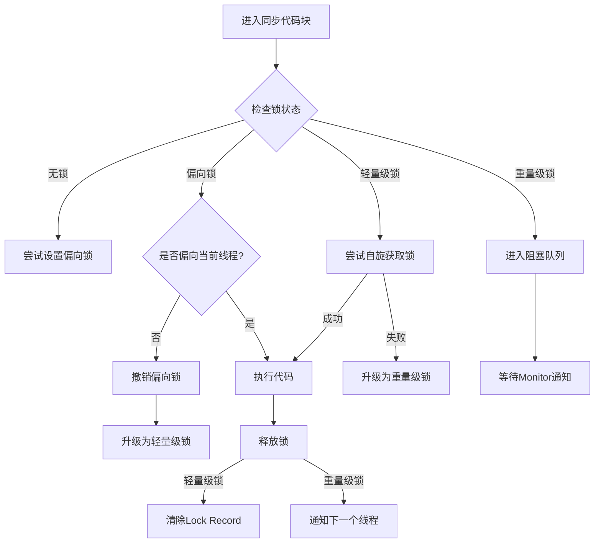

### 4.1.1 Synchronized对应的锁对象（重点）

理论上Java中所有的对象都可以作为锁，Java中根据synchronized使用的场景不同，其锁对象也是不一样的。

| 场景       | 具体分类 | 锁对象            | 代码示例                                          |
| ---------- | -------- | ----------------- | ------------------------------------------------- |
| 修饰方法   | 实例方法 | 当前实例对象      | public synchronized void method () { ... }        |
| 修饰方法   | 静态方法 | 当前类的Class对象 | public static synchronized void method () { ... } |
| 修饰代码块 | 代码块   | `( )`中配置的对象 | synchronized(object) { ... }                      |

在Java在JVM内存模型的堆中存储对象，每个对象都会存在对象头，对象头有**Mark Word 标记位**（分代年龄、锁状态、hashcode）和 **class pointer**（指向类元数据地址）。

当程序执行到同步代码块或者同步方法的时候，首先会去判断锁的状态，执行锁升级的流程。

（这里仅仅介绍重量锁）当遇到锁竞争激烈的时候，轻量锁会升级称为重量锁，每个对象都有可能会关联一个Monitor（因为Monitor是懒加载的，只有当锁升级为重量锁的时候才会创建Monitor）。在重量级锁状态下，Mark Word 的指针指向的是 Monitor 对象（ObjectMonitor），但具体位数与 JVM 实现相关（如 64 位系统会复用部分位）。

此时线程A访问同步代码块，通过对象头的 Monitor 指针找到关联的 ObjectMonitor，尝试通过 CAS 将 `owner` 字段设置为当前线程。失败则进入 EntryList 等待。

若当前线程已是 `owner`，`recursions++`，进行锁重入。

执行完毕后，退出同步块时，`recursions--`。当 `recursions == 0` 时，`owner` 置空，唤醒 EntryList 中的线程。

### 4.1.2 Monitor机制与Java对象头

#### 1 Monitor 是什么？

- 每个 Java 对象都关联一个 Monitor（管程/监视器）

- 实现线程互斥的核心机制

- 包含三个关键部分：

  | Owner         | 当前持有锁的线程           |
  | ------------- | -------------------------- |
  | **EntryList** | **等待锁的线程队列**       |
  | **WaitSet**   | **调用 wait() 的线程队列** |

#### 2 对象头与锁标记

```java
Object o = new Object();
synchronized(o) { /*...*/ } // 这里会修改 o 的对象头
```

- 对象内存结构：

  ```markdown
  |------------------------|------------------|----------------|
  |      Mark Word         |   Class Pointer  |  Instance Data |
  |------------------------|------------------|----------------|
  ```

- Mark Word 结构（64位系统）：

  

### 4.1.3 JVM 层面的实现

#### 1 字节码层面

查看编译后的字节码：

```
public void test();
  Code:
     0: aload_0
     1: getfield      #3  // 获取对象引用
     4: dup
     5: astore_1
     6: monitorenter   // 进入监视器
     7: aload_1
     8: monitorexit    // 正常退出
     9: goto  17
    12: astore_2
    13: aload_1
    14: monitorexit    // 异常退出
    15: aload_2
    16: athrow
    17: return
```

#### 2 锁升级过程

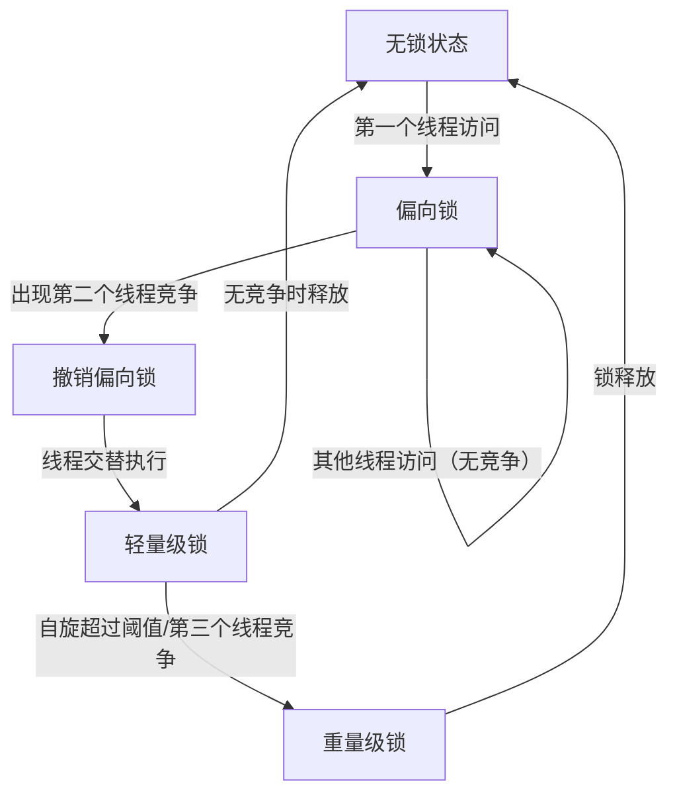

#### 3 不同锁状态的对比：

| 锁状态   | 优点             | 缺点            | 适用场景         |
| :------- | :--------------- | :-------------- | :--------------- |
| 偏向锁   | 加解锁无额外消耗 | 存在撤销开销    | 单线程访问       |
| 轻量级锁 | 线程交替执行     | 自旋消耗CPU     | 低竞争           |
| 重量级锁 | 不消耗CPU        | 线程阻塞/唤醒慢 | 高竞争、长临界区 |

### 4.1.4 Monitor 工作原理

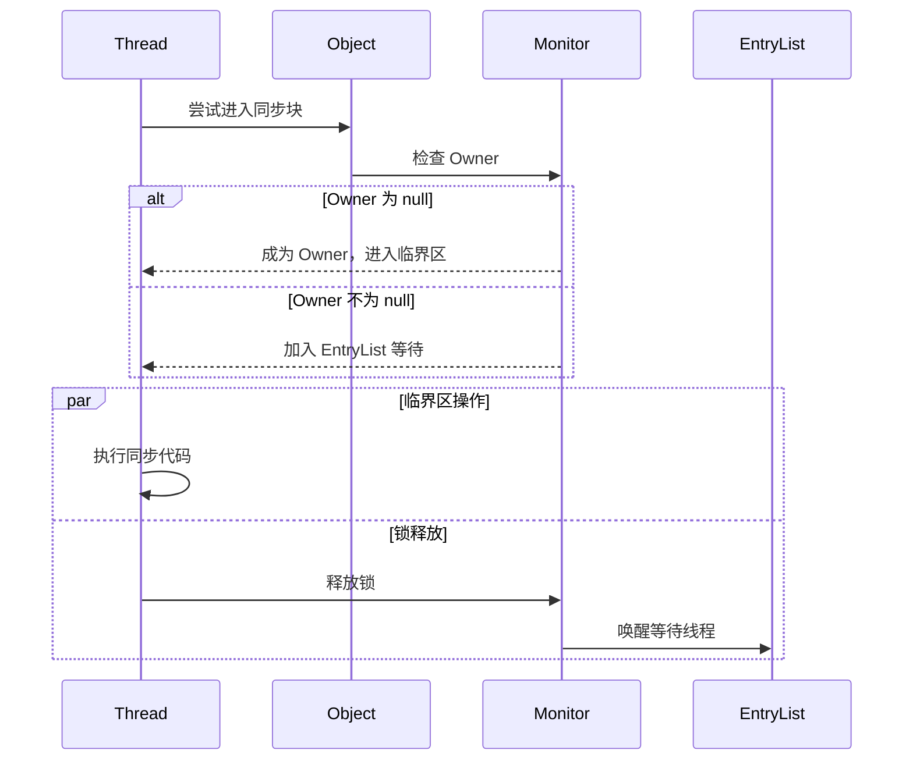

#### 1 获取锁流程

1. 当线程执行到同步代码块
2. 检查 Owner 字段：
   - 为空：成为 Owner，进入临界区
   - 非空（不等于self）：进入 EntryList 等待

#### 2 释放锁流程

1. 将 Owner 置为 null
2. 唤醒 EntryList 中的线程（非公平竞争）

#### 3 wait/notify 机制


```java
synchronized(obj) {
    obj.wait();  // 进入 WaitSet
    obj.notify();// 随机唤醒一个 WaitSet 中的线程
}
```

### 4.1.5 重要特性解析

#### 1 可重入性

```java
public synchronized void a() {
    b(); // 可重入
}
public synchronized void b() {
    // 无需重新获取锁
}
```

- 实现原理：Monitor 中维护计数器（每次进入+1，退出-1）

#### 2 内存可见性

- 遵循 happens-before 原则
- 解锁前修改对后续加锁线程可见

## 4.2 死锁和Lock锁

产生死锁的四个必要条件：

1. 互斥条件：一个资源每次只能被一个进程使用。
2. 请求与保持条件：一个进程因请求资源而阻塞时，对已获得的资源保持不放。
3. 不剥夺条件：进程已获得的资源，在未使用完之前，不能强行剥夺。
4. 循环等待条件：若干进程之间形成一种头尾相接的循环等待资源关系。

上述四个条件，只要破坏其任意一个或多个条件就可避免死锁的发生。

从 JDK 5.0 开始，Java 提供了更强大的线程同步机制——通过显示定义同步锁对象来实现同步。同步锁使用 Lock对象充当java.util.concurrent.locks.Lock 接口是

ReentrantLock 类实现了 Lock ，它拥有与 synchronized 相同的并发性和内存语义，在实现线程安全的控制中，比较常用的是 ReentrantLock ，可以显示加锁释放锁。

**synchronized 与 Lock 的对比:**

- Lock 是显示锁（手动开启和关闭），synchronized 是隐式锁，出了作用域自动释放
- Lock 只有代码加锁，synchronized 有代码块锁和方法锁
- 使用 Lock 锁，JVM 将花费较少的时间来调度线程，性能更好。并具有更好的扩展性（提供更多的子类）
- Lock > 同步代码块（已经进入了方法体，分配了相应资源）>同步方法（在方法体之外）

# 5 线程通信（重点）

## 5.1 管程法

并发写作模型""生产者/消费者模式""–>管程法

- 生产者：负责生产数据的模块（可能是方法，对象，线程，进程）
- 消费者：负责处理数据的模块（可能是方法，对象，线程，进程）
- 缓冲区：消费者不能直接使用生产者的数据，他们之间有个缓冲区

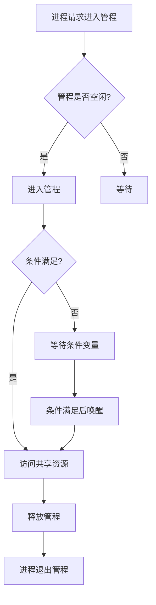

### 5.1.1 缓冲区

需要定义一个容器SynContainer，这个容器类似于临界资源（各进程采取互斥的方式，实现共享的资源称作*临界资源*）。所以这个缓冲区需要具备的特点有：

1. 是生产者和消费者可见的。
2. 生产者的产品存入缓存（**队列**）。
3. 消费者消费缓存中的产品。
4. 缓冲区有大小，当处于边界的时候要阻塞所有消费者或者生产者。
5. 由于缓冲区是临界资源需要互斥访问（**synchronized同步方法**）。

```java
/**
 * 容器
 */
class SynContainer {
    // 创建一个容器
    private final int size;
    private final Queue<Chicken> chickens;
    public SynContainer() {
        chickens = new LinkedList<Chicken>();
        this.size = 4;
    }

    public SynContainer(int size) {
        chickens = new LinkedList<Chicken>();
        this.size = size;
    }
    // 生产者生产的产品存入容器
    public synchronized void push(Chicken chicken) {
        // 如果容器满了就阻塞等待消费者消费
        if (chickens.size() >= size) {
            try {
                this.wait();
            } catch (InterruptedException e) {
                throw new RuntimeException(e);
            }
        }
        // 如果没有满就将产品存入容器中。
        chickens.offer(chicken);
        // 如果消费者阻塞就唤醒，唤醒阻塞的消费者
        this.notifyAll();
    }

    // 消费者消费容器中的产品
    public synchronized Chicken pop() {
        // 如果容器是空的，消费者就阻塞
        if (chickens.isEmpty()) {
            try {
                this.wait();
            } catch (InterruptedException e) {
                throw new RuntimeException(e);
            }
        }
        // 取出容器中的产品
        Chicken chicken = chickens.poll();
        // 唤醒所有进程包括生产者
        this.notifyAll();
        return chicken;
    }
}
```

### 5.1.2 生产者

生产者负责生产产品，将产品存入缓冲区，生产者需要具备如下特性：

1. 持有缓冲区（通过构造函数传入）
2. 将产品放入缓冲区（使用push方法）

```java
/**
 * 生产者生产产品存入容器中
 */
class Producer implements Runnable {
    private final SynContainer synContainer;

    public Producer(SynContainer synContainer) {
        this.synContainer = synContainer;
    }

    @Override
    public void run() {
        for (int i = 0; i < 100; i ++ ) {
            synContainer.push(new Chicken(i));
            System.out.println("生产了" + i + "只鸡" );
        }
    }
}
```

### 5.1.3 消费者

消费者负责消费产品，将产品从缓冲区中取出，消费者需要具备如下特性：

1. 持有缓冲区（通过构造函数传入）
2. 将产品从缓冲区中取出（使用poll方法）

```java
/**
 * 消费者消费产品
 */
class Consumer implements Runnable {
    private SynContainer synContainer;

    public Consumer(SynContainer synContainer) {
        this.synContainer = synContainer;
    }

    @Override
    public void run() {
       for (int i = 0; i < 100; i ++ ) {
           Chicken chicken = synContainer.pop();
           System.out.println("消费了-->" + chicken.id + "只鸡");
       }
    }
}
```

### 5.1.4 主方法测试

```java
public class Monitor {
    public static void main(String[] args) {
        SynContainer synContainer = new SynContainer(10);
        new Thread(new Producer(synContainer)).start();
        new Thread(new Consumer(synContainer)).start();
    }
}
```

## 5.2 信号灯法

信号灯法，通过对标志位的改变实现线程之间的交互。

信号灯法不需要使用一个缓冲区对数据进行短暂的存储。即只能一个线程运行一次后就将资源交由另一个线程使用。

假设有A，B两个线程，设置一个标志位flag，当标志位flag=true时，运行线程A，线程B等待，反之运行线程B，线程A等待。

### 5.2.1 生产者代码详解

```java
class Actor implements Runnable {
    Programme programme;
    public Actor(Programme programme) {
        this.programme = programme;
    }

    @Override
    public void run() {
        for (int i = 1; i <= 20; i ++ ) {
            if (i % 3 == 0) {
                programme.action(i+": 来段青海摇");
            } else if (i % 3 == 1) {
                programme.action(i+": 宇将军飞踢");
            } else {
                programme.action(i+": java之父教学");
            }
        }
    }
}
```

生产者(Actor)负责生产节目:

- 实现了Runnable接口,可以作为线程执行。
- 构造函数接收一个Programme对象,用于调用action方法。
- run方法中循环20次,每次根据不同条件生产不同的节目。
- 通过调用programme.action()方法来"生产"节目。

### 5.2.2 消费者代码详解

```java
class Audience implements Runnable {
    Programme programme;
    public Audience(Programme programme) {
        this.programme = programme;
    }

    @Override
    public void run() {
        for (int i = 1; i <= 20; i ++ ) {
            programme.watch();
        }
    }
}
```

消费者(Audience)负责观看节目:

- 同样实现了Runnable接口。
- 构造函数接收Programme对象,用于调用watch方法。
- run方法中循环20次,每次调用programme.watch()方法来"消费"节目。

### 5.2.3 产品代码详解

```java
class Programme {
    String programmeName;  // 表演的节目
    boolean flag = true;

    public synchronized void action(String programmeName) {
        if (!flag) {
            try {
                this.wait();
            } catch (InterruptedException e) {
                throw new RuntimeException(e);
            }
        }
        this.programmeName = programmeName;
        System.out.println("演员表演了：" + programmeName);
        this.notify();
        this.flag = !this.flag;
    }

    public synchronized void watch() {
        if (flag) {
            try {
                this.wait();
            } catch (InterruptedException e) {
                throw new RuntimeException(e);
            }
        }
        System.out.println("观众观看了：" + this.programmeName);
        this.notify();
        this.flag = !this.flag;
    }
}
```

Programme类代表产品(节目):

- programmeName存储节目名称。
- flag作为信号灯,控制生产和消费的交替进行。
- action方法(生产

### 5.2.4 测试

```java
public class Semaphore {
    public static void main(String[] args) {
        Programme programme = new Programme();
        new Thread(new Actor(programme)).start();
        new Thread(new Audience(programme)).start();
    }
}
```

# 6 手写线程池（重点）

## 6.1 线程池概述

这顾名思义，线程池就是管理一系列线程的资源池，其提供了一种限制和管理线程资源的方式。每个线程池还维护一些基本统计信息，例如已完成任务的数量。

1  线程池的好处：

- **降低资源消耗**。通过重复利用已创建的线程降低线程创建和销毁造成的消耗。
- **提高响应速度**。当任务到达时，任务可以不需要等到线程创建就能立即执行。
- **提高线程的可管理性**。线程是稀缺资源，如果无限制的创建，不仅会消耗系统资源，还会降低系统的稳定性，使用线程池可以进行统一的分配，调优和监控。

2  <font color="red">**线程池为什么好，速度为什么快，资源消耗为什么少？**</font>

**因为线程需要创建结束后需要销毁，而线程池实现线程复用，因为线程创建和销毁会消耗大量资源，在执行了完成一个任务后，线程不会马上销毁，而是会不断的获取新的任务执行。**

- 线程复用**减少了线程创建和销毁的开销**，避免了频繁创建和销毁线程带来的系统资源消耗，任务可以快速被执行,无需等待线程创建。
- 可以**限制并发线程数**，防止资源过度消耗，提供了线程管理、调度和监控的机制
- 核心线程**随时待命**,可以立即执行任务，无需等待线程创建的时间
- **避免了**创建大量线程导致的**系统崩溃**，线程异常可以被捕获和处理,不会影响其他任务
- 可以灵活配置线程池参数以适应不同场景，**提供了**不同的**任务队列策略和拒绝策略**

3  **手写线程池整体架构**，该线程池实现包含以下核心组件：

- **BlockingQueue**：基于双端队列的阻塞队列，支持超时等待
- **ThreadPool**：线程池主体，包含线程管理、任务调度逻辑
- **Worker**：工作线程实现类
- **RejectPolicy**：拒绝策略接口
- **测试用例**：包含生产者-消费者和演员-观众两组演示案例

### 6.1.1 **创建工作线程流程图**

1. **提交任务**
   用户调用 `execute(Runnable task)` 提交任务到线程池。
2. **检查线程池状态**
   - 如果线程池已关闭（`isShutdown` 为 `true`），直接执行拒绝策略（如日志记录、抛出异常等）。
   - 如果线程池正常运行，进入下一步。
3. **判断核心线程数**
   - 如果当前工作线程数 `<` 核心线程数（`corePoolSize`），**创建核心线程**（`Worker` 对象），并立即执行任务。
   - 否则，尝试将任务加入任务队列。
4. **任务队列缓冲**
   - 如果任务队列未满，任务会被加入队列等待执行。
   - 如果队列已满，检查当前工作线程数是否 `<` 最大线程数（`maximumPoolSize`）。
5. **创建非核心线程**
   - 如果未达到最大线程数，**创建非核心线程**（临时线程），执行当前任务。
   - 如果已超过最大线程数，执行拒绝策略。

**关键逻辑**

- **同步控制**：在判断工作线程数和操作 `workers` 集合时，通过 `synchronized(workers)` 保证线程安全。
- **任务队列的双层缓冲**：优先使用核心线程，队列作为缓冲层，最后才创建非核心线程。
- **拒绝策略**：用户可自定义拒绝行为（如代码中的 `RejectPolicy` 接口）。

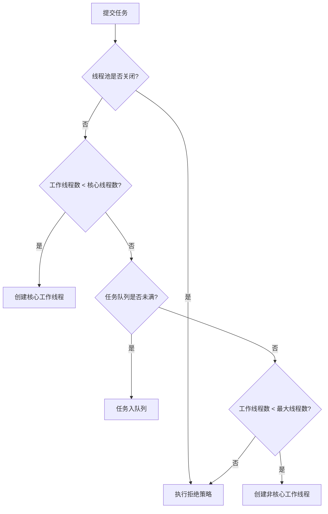

### 6.1.2 **工作线程执行任务流程图**

1. **线程启动**
   - 工作线程（`Worker`）启动后，优先执行其绑定的第一个任务（`firstTask`）。
2. **循环获取任务**
   - 第一个任务执行完成后，进入循环流程：
     1. **检查线程池状态**
        - 如果线程池已关闭，直接结束线程。
        - 否则，尝试从任务队列中获取任务（`poll` 方法）。
3. **任务获取结果**
   - **获取到任务**：立即执行任务。
   - **未获取到任务**（超时或队列为空）：
     - 检查当前工作线程数是否 `>` 核心线程数。
     - 如果是，**回收当前线程**（从 `workers` 集合中移除并结束线程）。
     - 否则，继续等待新任务。
4. **任务执行与循环**
   - 每次任务执行完成后，重新检查线程池状态并尝试获取新任务。

**关键逻辑**

- **超时机制**：非核心线程通过 `taskQueue.poll(keepAliveTime, timeUnit)` 实现空闲超时回收。
- **线程自我回收**：非核心线程在空闲超时后主动释放资源，而核心线程会永久保留（除非线程池关闭）。
- **关闭响应**：线程池关闭时，通过设置 `isShutdown` 标志并唤醒所有等待线程，快速终止工作线程。

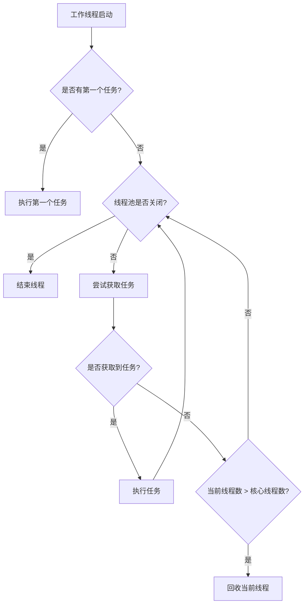

### 6.1.3 **总结**

- **核心设计**：通过核心线程、任务队列、非核心线程的三级调度，平衡资源利用率和响应速度。
- **弹性伸缩**：非核心线程按需创建，空闲时自动回收，避免资源浪费。
- **安全关闭**：通过标志位传播关闭状态，确保线程池和任务队列协同终止。

## 6.2 核心组件详解

### 6.2.1 BlockingQueue（任务队列）

```java
class BlockingQueue<T> {
    private final Deque<T> deque; // 双端队列存储元素
    private final ReentrantLock lock; // 可重入锁
    private final Condition fullWaitSet; // 队列满等待条件
    private final Condition emptyWaitSet; // 队列空等待条件
    private final int capacity; // 队列容量
    private volatile boolean isShutdown = false; // 关闭状态
}
```

**关键方法分析**：

- `poll(long timeout, TimeUnit unit)`：
  - 带超时时间的出队操作
  - 使用`awaitNanos()`实现精确的纳秒级等待
  - 唤醒条件：队列非空或线程池关闭
- `put(T task)`：
  - 阻塞式入队操作
  - 当队列满时通过`fullWaitSet.await()`挂起线程
  - 入队后通过`emptyWaitSet.signal()`唤醒消费者
- `shutdown()`：
  - 设置关闭标志
  - 唤醒所有等待线程实现快速关闭

poll方法在队列为空的时候不断循环，尝试取数据，有数据的时候就返回，且有超时限制，如果超时了就返回空。<font color="red">emptyWaitSet.awaitNanos(nanos) 将当前线程进入等待状态**TIMED_WAITING**，最多等待nanos纳秒，注意可能线程会被提前唤醒，所以这个函数的返回值是剩余时间</font>。

```java
public T poll(long timeout, TimeUnit unit) throws InterruptedException {
    long nanos = unit.toNanos(timeout);
    lock.lockInterruptibly();
    try {
        while (deque.isEmpty() && !isShutdown) {
            if (nanos <= 0) return null;
            nanos = emptyWaitSet.awaitNanos(nanos);
        }
        return isShutdown ? null : deque.removeFirst();
    } finally {
        lock.unlock();
    }
}
```

**take方法类似于poll方法，但是是无限制的阻塞。**

offer方法，添加元素到阻塞队列中，如果**阻塞队列满了或者线程池关闭了**就拒绝任务。每次来了新任务都需要唤醒由于执行poll或者take方法进入等待状态的线程。

**<font color="red">注意点：emptyWaitSet是Condition对象，Condition对象内部会有一个等待队列，当调用wait方法时，线程会被放入该队列。当调用signal方法时会被唤醒。</font>**

```java
public boolean offer(T task) {
    lock.lock();
    try {
        if (isShutdown || deque.size() == capacity)
            return false;
        deque.addLast(task);
        emptyWaitSet.signalAll();
        return true;
    } finally {
        lock.unlock();
    }
}
```

**put不同于offer**，当队列满了offer方法会直接返回false。然而put方法会让该线程进入等待状态。

```java
public void put(T task) throws InterruptedException {
    lock.lockInterruptibly();
    try {
        while (deque.size() == capacity && !isShutdown) {
            fullWaitSet.await();
        }
        if (isShutdown) return;
        deque.addLast(task);
        emptyWaitSet.signalAll();
    } finally {
        lock.unlock();
    }
}
```

**shutdown会让isShutdown=true然后唤醒所有被阻塞的线程，然后再循环条件 !isShutdown 判断不通过退出循环从而结束线程池中的线程。**

```java
public void shutdown() {
    lock.lock();
    try {
        isShutdown = true;
        fullWaitSet.signalAll();
        emptyWaitSet.signalAll();
    } finally {
        lock.unlock();
    }
}
```

### 6.2.2 ThreadPool（线程池类）

ThreadPool类是线程池的核心实现，包含以下重要属性和方法：

- taskQueue: 用于存储待执行的任务
- workers: 存储工作线程
- corePoolSize和maximumPoolSize: 控制线程池大小
- keepAliveTime和timeUnit: 控制非核心线程的空闲时间
- rejectPolicy: 任务拒绝策略
- execute方法: 提交任务到线程池
- shutdown方法: 关闭线程池

**queueCapacity是构造方法传入参数，用于初始化任务队列的大小，任务队列是阻塞队列。**

execute 方法首先会判断线程池是否关闭，关闭了之后到来的任务task，execute方法调用rejectPolicy拒绝策略进行拒接。

为了确保线程安全，**会对workers工作线程集合进行互斥访问**。当新到来一个任务时，如果工作线程个数小于corePoolSize会创建新的工作线程，否则复用以创建的工作线程。

**如果添加任务失败了（任务执行队列满了）就会试图创建一个新的工作线程执行该任务（缓解任务过多，提供一定的弹性）。**

如果都失败了，就会采用**拒绝策略处理任务**。

```java
public void execute(Runnable task) {
    if (isShutdown) {
        rejectPolicy.reject(taskQueue, task);
        return;
    }
    synchronized (workers) {
        // 创建核心线程
        if (workers.size() < corePoolSize) {
            Worker worker = new Worker(task);
            workers.add(worker);
            worker.start();
        }
        // 尝试入队
        else if (taskQueue.offer(task)) {
            // 任务已加入队列
        }
        // 创建非核心线程
        else if (workers.size() < maximumPoolSize) {
            Worker worker = new Worker(task);
            workers.add(worker);
            worker.start();
        }
        // 执行拒绝策略
        else {
            rejectPolicy.reject(taskQueue, task);
        }
    }
}
```

shutdown方法是关闭线程池，将isShutdown变成true，通过关闭任务队列（任务队列会不断轮询阻塞获取）

```java
public void shutdown() {
    synchronized (workers) {
        isShutdown = true;
        //            for (Worker worker : workers) {
        //                worker.interrupt();
        //            }
    }
    taskQueue.shutdown();
}
```

**线程池的完整实现。**

```java
class ThreadPool {
    private final BlockingQueue<Runnable> taskQueue;
    private final HashSet<Worker> workers = new HashSet<>();
    private final int corePoolSize;
    private final int maximumPoolSize;
    private final long keepAliveTime;
    private final TimeUnit timeUnit;
    private final RejectPolicy<Runnable> rejectPolicy;
    private volatile boolean isShutdown = false;

    public ThreadPool(int corePoolSize, int maximumPoolSize,
                      long keepAliveTime, TimeUnit timeUnit,
                      int queueCapacity, RejectPolicy<Runnable> rejectPolicy) {
        this.corePoolSize = corePoolSize;
        this.maximumPoolSize = maximumPoolSize;
        this.keepAliveTime = keepAliveTime;
        this.timeUnit = timeUnit;
        this.taskQueue = new BlockingQueue<>(queueCapacity);
        this.rejectPolicy = rejectPolicy;
    }

    public void execute(Runnable task) { ... }

    public void shutdown() { ... }

    private class Worker extends Thread { ... }
}
```

### 6.2.3 Worker（工作线程实现类）

**Worker是线程池类中的内部类。**

**ThreadPool线程池中需要一个集合workers来存储工作线程Worker**，这个工作线程集合workers它的最大容量不超过corePoolSize（在代码中还是给了一个扩容的上限maximumPoolSize）

**这个工作线程不断的循环取出任务队列中的任务执行**，通过线程池中会提供一个maximumPoolSize，**提供一定的弹性也就是任务最多不超过maximumPoolSize大小**，应对任务过多导致的频繁阻塞等待。

**当任务队列空闲的时候**，**会销毁多出来的工作线程**。

```java
private class Worker extends Thread {
    private Runnable firstTask;
    Worker(Runnable firstTask) {
        this.firstTask = firstTask;
    }
    @Override
    public void run() {
        try {
            // 执行第一个任务
            if (firstTask != null) {
                firstTask.run();
                firstTask = null;
            }
            // 循环获取任务
            while (!isShutdown) {
                Runnable task = taskQueue.poll(keepAliveTime, timeUnit);
                if (task != null) {
                    task.run();
                } else {
                    // 检查是否需要回收线程
                    synchronized (workers) {
                        if (workers.size() > corePoolSize) {
                            workers.remove(this);
                            break;
                        }
                    }
                }
            }
        } catch (InterruptedException e) {
            // 响应中断
        } finally {
            synchronized (workers) {
                workers.remove(this);
            }
        }
    }
}
```

# 7 JUC：java并发编程库

## 7.1 Lock

7.1 Lock介绍

公平锁和非公平锁 

###### **Synchronized 和 Lock区别**

1. Synchronized 内置的java关键字，Lock是一个java类
2. Synchronized 无法判断获取锁的状态，Lock 可以判断是否获取到了锁
3. Synchronized 会自动释放锁，lock需要手动释放！如果不释放锁，死锁。
4. Synchronized 线程1（获得锁）、线程2（等待）；Lock锁不一定会等待（**lock.tryLock()**）
5. Synchronized 可重入锁，不可以中断的，非公平。Lock 可重入锁，可以判断锁，默认非公平（可以设置）。
6. Synchronized 适合锁少量的代码同步问题，Lock 适合锁大量的同步代码。

###### 锁是什么，如何判断锁的是谁？

## 7.2 生产者和消费者问题（重点）

### 7.2.1 虚唤醒

###### 生产者和消费者问题 Synchronized 版本

这个 synchronized 锁的是方法，方法在方法区（元空间/永久代）

面试：单例模式、排序算法、生产者消费者、死锁。

```java
class Data{
   private int number = 0;
   // +1 生产者
   public synchronized void increment() throws InterruptedException {
      if (number != 0) {
         // 等待
         this.wait();
      }
      number ++ ;
      // 通知其他进程+1完毕
      this.notifyAll();
   }

   // -1 消费者
   public synchronized void decrement() throws InterruptedException {
      if (number == 0) {
         // 等待
         this.wait();
      }
      number -- ;
      // 通知其他进程-1完毕
      this.notifyAll();
   }
}
```

上一段代码中，我们只希望生产生产了消费者马上进行消费，number只会等于0或1。当只有两个线程时程序可以正确执行。问题存在，如果此时存在两个生产者和两个消费者的适合。会出现<font color="red">**虚唤醒！**</font>

<font color = "red">具体为，当 number != 0 时，两个生产者都阻塞了（均进入了increment中的if语句）。此时消费者消费，唤醒了所有进程。两个生产者都被唤醒执行了number ++ ，此时number就等于2了，产生了预料之外的结果。</font>

所以通过将**if改成whlie**来解决这个问题。**还是有一定可能导致错误**，**在并行条件下**。

```java
class Data{
   private int number = 0;
   // +1
   public synchronized void increment() throws InterruptedException {
      while (number != 0) {
         // 等待
         this.wait();
      }
      number ++ ;
      // 通知其他进程+1完毕
      this.notifyAll();
   }

   // -1
   public synchronized void decrement() throws InterruptedException {
      while (number == 0) {
         // 等待
         this.wait();
      }
      number -- ;
      // 通知其他进程-1完毕
      this.notifyAll();
   }
}
```

###### JUC版本生产者和消费者问题

**通过Lock找到condition，condition取代了synchronized中的锁监视器monitor。**不同于synchronized的非公平锁，**Condition可以精准的通知和唤醒线程。**

通过Lock中的condition可以实现，A1 生产 1号 商品，B1 和 B12 都可以消费， 生产 2号 商品，B12 可以消费。


```java
/**
 * @author: 16404
 * @date: 2025/2/2 12:58
 **/
public class test {
   public static void main(String[] args) throws InterruptedException {
      Data data = new Data();

      new Thread(() -> {
         for (int i = 0; i < 20; i ++ ) {
             data.A1();
         }
      }, "A1").start();
      new Thread(() -> {
         for (int i = 0; i < 20; i ++ ) {
             data.A2();
         }
      }, "A2").start();
      new Thread(() -> {
         for (int i = 0; i < 20; i ++ ) {
             data.B1();
         }
      }, "B1").start();
      new Thread(() -> {
         for (int i = 0; i < 20; i ++ ) {
             data.B12();
         }
      }, "B12").start();
      Thread.sleep(2000);
   }
}
class Data{
   /**
    * 实现一个功能，A1 生产 1号 商品，B1 和 B12 都可以消费
    *            A2 生产 2号 商品，B12 可以消费
    */
   // 商品1
   private int number1 = 0;
   // 商品2
   private int number2 = 0;
   private final Lock lock = new ReentrantLock();
   private final Condition conditionA1 = lock.newCondition();
   private final Condition conditionA2 = lock.newCondition();
   private final Condition conditionB1 = lock.newCondition();
   private final Condition conditionB12 = lock.newCondition();
   Condition condition = lock.newCondition();

   // 生产者A1
   public void A1() {
      lock.lock();
      try {
         while (number1 != 0) {
            conditionA1.await();
         }
         number1 ++ ;
         System.out.println(Thread.currentThread().getName() + " 生产了 => number1=" + number1);
         conditionB1.signal();
         conditionB12.signal();
      } catch (InterruptedException e) {
          throw new RuntimeException(e);
      } finally {
         lock.unlock();
      }
   }
   // 生产者A2
   public void A2() {
      lock.lock();
      try {
         while (number2 != 0) {
            conditionA2.await();
         }
         number2 ++ ;
         System.out.println(Thread.currentThread().getName() + " 生产了 => number2=" + number2);
         conditionB12.signal();
      } catch (InterruptedException e) {
         throw new RuntimeException(e);
      } finally {
         lock.unlock();
      }
   }

   // 消费者B1
   public void B1() {
      lock.lock();
      try {
         while (number1 == 0) {
            conditionB1.await();
         }
         number1 -- ;
         System.out.println(Thread.currentThread().getName() + " 消费了 => number1=" + number1);
         conditionA1.signal();
      } catch (InterruptedException e) {
         throw new RuntimeException(e);
      } finally {
         lock.unlock();
      }
   }

   // 消费者B12
   public void B12() {
      lock.lock();
      try {
         while (number1 == 0 && number2 == 0) {
            conditionB12.await();
         }
         if (number1 != 0) {
            number1 --;
            System.out.println(Thread.currentThread().getName() + " 消费了 => number1=" + number1);
            conditionA1.signal();
         }
         else {
            number2 --;
            System.out.println(Thread.currentThread().getName() + " 消费了 => number2=" + number2);
            conditionA2.signal();
         }
      } catch (InterruptedException e) {
         throw new RuntimeException(e);
      } finally {
         lock.unlock();
      }
   }
}
```

### 7.2.2 synchronized和Lock同时使用导致死锁

注意：Synchronized 和 Lock 使用的不是同一个锁监视器，`synchronized` 使用的是 JVM 提供的锁监视器，锁定的是当前对象实例（`this`）。`ReentrantLock` 使用的是它自己的锁监视器，与 `synchronized` 的锁监视器无关。当生产者A1执行了increment() 方法：期间 Synchronized 获取了锁、Lock 获取锁、number ++ 、Lock 释放锁、Synchronized 释放锁。

如果此时，然后第二个生产者 A2 执行 increment() 方法，进入 Synchronized 获取了锁、Lock 获取锁，然后由于number不等于0，进入循环，然后执行了 condition.wait() 此时 Lock的锁释放了，该线程阻塞，但是 Synchronized 的锁没有释放，导致其他线程执行同步代码块的时候无法获取 Synchronized 的锁造成死锁。

```java
public class test {
   public static void main(String[] args) throws InterruptedException {
      Data data = new Data();
      new Thread(() -> {
         for (int i = 0; i < 20; i ++ ) {
             try {
                data.increment();
             } catch (InterruptedException e) {
                 throw new RuntimeException(e);
             }
         }
      }, "A1").start();
      new Thread(() -> {
         for (int i = 0; i < 20; i ++ ) {
            try {
               data.increment();
            } catch (InterruptedException e) {
               throw new RuntimeException(e);
            }
         }
      }, "A2").start();
      new Thread(() -> {
         for (int i = 0; i < 20; i ++ ) {
            try {
               data.decrement();
            } catch (InterruptedException e) {
               throw new RuntimeException(e);
            }
         }
      }, "B1").start();
      new Thread(() -> {
         for (int i = 0; i < 20; i ++ ) {
            try {
               data.decrement();
            } catch (InterruptedException e) {
               throw new RuntimeException(e);
            }
         }
      }, "B2").start();
      Thread.sleep(2000);
   }
}
class Data{
   private int number = 0;
   Lock lock = new ReentrantLock();
   Condition condition = lock.newCondition();
   // 生产者
   public synchronized void increment() throws InterruptedException {
      lock.lock();
      try {
         // 业务代码
         while (number != 0) {
            // 等待
            condition.await();
         }
         number ++ ;
         System.out.println(Thread.currentThread().getName() + "=>" + number);
         condition.signalAll();
      } catch (Exception e) {
         e.printStackTrace();
      } finally {
         lock.unlock();
      }
   }
   // 消费者
   public synchronized void decrement() throws InterruptedException {
      lock.lock();
      try {
         // 业务代码
         while (number == 0) {
            // 等待
            condition.await();
         }
         number -- ;
         System.out.println(Thread.currentThread().getName() + "=>" + number);
         condition.signalAll();
      } catch (Exception e) {
         e.printStackTrace();
      } finally {
         lock.unlock();
      }
   }
}
```

## 7.3 锁的八大问题

### 7.3.1 sleep函数

synchronized 锁的对象是方法的调用者！两个方法用的是同一个锁，**在这段代码中默认锁的是this**，在这段代码中锁的是phone这个对象，**在堆区中phone对象中的对象头**，对象头MarkWord字段中锁状态是轻量锁，其中前62位是锁记录的指针，**指向拥有该锁线程的锁记录**。

**<font color="red">重点：</font>**

- synchronized 关键字修饰方法，synchronized作用于被创建出来的对象。
- synchronized 关键字修饰的是代码块，如果后面没有加上  (obj)，那么**默认是 this**。
- synchronized 关键字 修饰的是静态方法，**synchronized作用于元空间中的class对象**（JVM中全局唯一）。
-  **sleep和wait方法的区别就是sleep不会释放锁**。

```java
/**
 * @author: 16404
 * @date: 2025/2/2 12:58
 **/
public class test {
   public static void main(String[] args) {
       Phone phone = new Phone();
       new Thread(()-> phone.SendMsg()).start();

       try {
           Thread.sleep(1000);
       } catch (InterruptedException e) {
           throw new RuntimeException(e);
       }
       new Thread(()-> phone.Call()).start();
   }
}
class Phone{
   public synchronized void SendMsg() {
       try {
           Thread.sleep(2000);
       } catch (InterruptedException e) {
           throw new RuntimeException(e);
       }
      System.out.println("发短信");
   }
   public synchronized void Call() {
      System.out.println("打电话");
   }
}
```

普通方法，同步方法，同步静态方法在字节码上的区别。，体现在flags中，**有 ACC_SYNCHRONIZED 标识表示添加了同步关键字**。

```java
// 同步实例方法
public synchronized void sendMsg();
  flags: (0x0021) ACC_PUBLIC, ACC_SYNCHRONIZED

// 非同步实例方法
public void sendMsgNonSync();
  flags: (0x0001) ACC_PUBLIC

// 同步静态方法
public static synchronized void sendMsgStatic();
  flags: (0x0029) ACC_PUBLIC, ACC_STATIC, ACC_SYNCHRONIZED
```

### 7.3.2 Java代码执行流程的回顾

###### **1. 类加载阶段**

当你首次使用一个类（例如 `new MyClass()`）时，JVM 会执行以下步骤：

1. **加载（Loading）**：

   通过类加载器（ClassLoader）从磁盘（`.class`文件）或网络加载类的字节码。

   类的元数据（包括方法字节码）存储在 **元空间（Metaspace）** 中。

   **元空间的作用**：存储类的结构信息（如方法字节码、字段描述、常量池等）。

2. **验证（Verification）**：

   确保字节码符合 JVM 规范，防止恶意代码执行。

3. **准备（Preparation）**：

   为类的静态变量分配内存并初始化默认值（如 `int` 初始化为 `0`）。

4. **解析（Resolution）**：

   将符号引用（如类名、方法名）转换为直接引用（内存地址）。

5. **初始化（Initialization）**：

   执行类的静态代码块（`static {}`）和静态变量显式初始化。

###### **2. 实例化对象**

当你执行 `new MyClass()` 时：

1. **堆内存分配**：

   在堆（Heap）中为对象实例分配内存，存储对象的成员变量（包括继承的字段）。

   对象头（Header）中会记录指向元空间中类元数据的指针（用于方法调用）。

2. **构造函数调用**：

   调用 `<init>` 方法（构造函数），初始化对象的成员变量。

###### **3. 方法调用**

当调用对象的方法（例如 `obj.myMethod()`）时：

1. **栈帧（Stack Frame）创建**：

   每个线程有自己的 **虚拟机栈（JVM Stack）**。

   方法调用时，会在栈中创建一个栈帧，包含：

   - **局部变量表（Local Variables）**：存储方法参数和局部变量。
   - **操作数栈（Operand Stack）**：用于执行字节码指令（如算术运算）。
   - **动态链接（Dynamic Linking）**：指向元空间中方法字节码的符号引用。
   - **方法返回地址（Return Address）**：记录方法执行完毕后回到的位置。

2. **字节码执行**：

   **执行引擎（Execution Engine）**（如解释器或 JIT 编译器）会从元空间中读取方法的字节码。

   **解释器**逐条解释执行字节码指令，操作局部变量表和操作数栈。

   **JIT 编译器**（运行时优化）可能会将热点代码（频繁执行的代码）编译为本地机器码，直接由 CPU 执行。

###### **4. 关键点澄清**

- **元空间存储的内容**：
  方法的字节码（即代码逻辑）存储在元空间，但 **方法的执行过程不涉及将字节码“复制”到栈中**。
  栈帧中存储的是方法执行时的 **运行时数据**（如局部变量、操作数栈），而不是字节码本身。
- **方法调用的本质**：
  执行引擎通过动态链接找到方法的字节码（元空间中），然后基于栈帧中的运行时数据执行指令。

### 7.3.3 方法、同步方法和静态同步方法在方法调用期间的区别

**一、核心概念回顾**

- **程序计数器（Program Counter Register）**：

  每个线程独有，**记录当前线程正在执行的字节码指令地址**。

  **唯一不会抛出 `OutOfMemoryError` 的区域**。

  在多线程切换时，程序计数器确保线程恢复执行时能回到正确的位置。

- **方法调用本质**：

  方法调用时，JVM 为方法创建 **栈帧**（Stack Frame），存储局部变量表、操作数栈、动态链接、方法返回地址等信息。

  方法执行完成后，栈帧被销毁，程序计数器更新为下一条指令地址。

###### **二、普通方法调用**

**1. 调用流程**

1. **创建栈帧**：在虚拟机栈中为方法分配栈帧。
2. **参数传递**：将参数值存入局部变量表。
3. **字节码执行**：执行引擎根据程序计数器指向的指令地址，逐条执行字节码。
4. **方法返回**：执行 `return` 指令，弹出栈帧，程序计数器更新为调用者的下一条指令地址。

**2. 特点**

- **无锁机制**：普通方法不涉及锁的获取和释放。
- **线程安全**：若方法不操作共享资源，天然线程安全；否则需手动同步。

###### **三、同步方法（实例方法）**

**1. 调用流程**

1. **获取锁**：

   JVM 隐式获取当前实例对象（`this`）的锁（通过 `ACC_SYNCHRONIZED` 标志）。

   底层可能使用 `monitorenter` 指令（具体由 JVM 实现决定）。

2. **创建栈帧**：与普通方法相同。

3. **执行字节码**：程序计数器记录指令地址，执行引擎执行方法体。

4. **释放锁**：方法执行完毕时，JVM 隐式释放锁（通过 `monitorexit` 指令）。

**2. 特点**

- **锁对象**：实例对象（`this`）。

- **线程安全**：同一实例的多个线程需竞争锁。

- **字节码差异**：

  方法的访问标志包含 `ACC_SYNCHRONIZED`。

  无显式 `monitorenter`/`monitorexit` 指令（隐式通过标志实现）。

**3. 示例**

- ```java
  public synchronized void syncMethod() {
      // 方法体
  }
  ```

###### **四、静态同步方法**

**1. 调用流程**

1. **获取锁**：JVM 隐式获取当前类的 `Class` 对象（如 `MyClass.class`）的锁。
2. **创建栈帧**：与普通方法相同。
3. **执行字节码**：程序计数器记录指令地址，执行引擎执行方法体。
4. **释放锁**：方法执行完毕时，隐式释放锁。

**2. 特点**

- **锁对象**：类的 `Class` 对象（所有实例共享同一把锁）。
- **线程安全**：所有调用该静态方法的线程需竞争同一把锁。
- **字节码差异**：方法的访问标志包含 `ACC_STATIC` 和 `ACC_SYNCHRONIZED`。

**3. 示例**

- ```java
  public static synchronized void staticSyncMethod() {
      // 方法体
  }
  ```

###### **五、底层实现细节**

**1. 同步方法的锁实现**

- **`ACC_SYNCHRONIZED` 标志**：

  JVM 通过该标志识别同步方法。

  方法调用时自动获取锁，返回时自动释放锁。

- **锁升级**：若多线程竞争激烈，JVM 会将锁从偏向锁升级为轻量级锁，最终升级为重量级锁。

**2. 静态同步方法的锁实现**

- **锁对象**：`Class` 对象在堆中分配，与普通对象类似。
- **全局唯一性**：类的 `Class` 对象在 JVM 中唯一，所有实例共享。

### 7.3.4 锁监视器--同一个？不同！ 

线程A调用静态同步方法sendMsg，获取的是 phone 模板类的锁。

线程B调用的是同步方法，实例对象的锁。

**二者的锁监视器不是同一个**。

```java
/**
 * @author: 16404
 * @date: 2025/2/2 12:58
 **/
public class test {
    public static void main(String[] args) throw InterruptedException{
        Phone phone = new Phone();
        new Thread(() -> {
            Thread.sleep(200);
            phone.sendMsg();
        }, "A").start();
        
        Thread.sleep(10);
        
        new Thread(() -> phone.call(), "B").start();
    }
}
class Phone {
    // 静态的同步方法 锁的是 Class 类模板
    public static synchronized void sendMsg() {
        System.out.println("发短信");
    }
    // 普通方法，锁的调用者。
    public synchronized void call() {
        System.out.println("打电话");
    }
}
```

## 7.4 集合类不安全

### 7.4.1 List不安全

<font color="red">**java中的List集合提供了大量的函数，例如排序，指定位置插入，删除指定元素等，这些操作再执行过程中可能会因为多线程导致线程安全问题，所以java提供了多种方法来保证线程安全。**</font>

 三种解决 `List` 线程不安全问题的方案的详细介绍及其各自的优势：

###### **1. `Vector`**

- `Vector` 是 Java 早期的线程安全集合类，所有方法都通过 `synchronized` 关键字修饰实现同步。

- 内部使用数组存储数据，支持动态扩容。

  **优势**

  1. **简单易用**：直接使用 `Vector` 即可保证线程安全，无需额外配置。
  2. **强一致性**：所有操作（包括迭代、复合操作）都是原子的，通过锁保证数据强一致性。
  3. **兼容性**：适用于低并发场景或需要兼容旧代码的遗留系统。

  **缺点**

  - **性能低**：所有方法加锁（包括读操作），高并发下锁竞争激烈，性能较差。
  - **过时设计**：动态扩容策略（默认翻倍）可能导致内存浪费，且不支持现代集合框架的优化。

###### **2. `Collections.synchronizedList`**

- 通过装饰器模式将普通 `List`（如 `ArrayList`）包装成线程安全的集合。

- 所有方法通过 `synchronized` 代码块实现同步，锁对象是 `mutex`（默认是包装后的集合本身）。

  **优势**

  1. **灵活性**：可以包装任何 `List` 实现（如 `ArrayList`、`LinkedList`），适配不同场景需求。
  2. **轻量级**：仅在需要时加锁，锁粒度与 `Vector` 相同，但支持更灵活的底层数据结构。
  3. **兼容性**：与现代集合框架无缝集成，适用于需要线程安全但不愿使用 `Vector` 的场景。

  **缺点**

  - **复合操作非原子性**：迭代或复合操作（如 `contains` + `add`）仍需外部同步：

###### **3. `CopyOnWriteArrayList`**

- 基于 **写时复制（Copy-On-Write）** 机制：

  - **读操作**：无锁，直接访问底层数组。
  - **写操作**：复制原数组，修改副本后替换原数组（通过 `ReentrantLock` 保证原子性）。

  **优势**

  1. **读高性能**：读操作完全无锁，适合 **读多写少** 的高并发场景。
  2. **弱一致性**：迭代器基于创建时的数组快照，避免 `ConcurrentModificationException`。
  3. **写安全**：写操作通过锁保证原子性，但不会阻塞读操作。

  **缺点**

  - **内存开销大**：每次写操作都会复制数组，内存占用高，不适合频繁修改的场景。
  - **数据延迟**：读操作可能访问到旧数据，不适用于强一致性要求的场景。

### 7.4.2 Set不安全

```java
1. Set<String> set1 = Collections.synchronizedSet(new HashSet<String>());
2. Set<String> set2 = new CopyOnWriteArraySet<>();
```

HashSet底层就是new了一个HashMap，只是利用了HashMap的Key。HashSet的add方法就是调用了HashMap的put方法。

### 7.4.3 Map不安全（难点）

```java
Map<String, String> map1 = Collections.synchronizedMap(new HashMap<String, String>());
ConcurrentHashMap<String, String> map2 = new ConcurrentHashMap<>();
```

### 7.4.4 Callable接口

```java
public class test {
    public static void main(String[] args) throws ExecutionException, InterruptedException {
        MyThread thread = new MyThread();
        FutureTask<Integer> future = new FutureTask<>(thread);
        new Thread(future, "Test").start();
        Integer result = future.get();
    }
}

class MyThread implements Callable<Integer> {

    @Override
    public Integer call() throws Exception {
        return 1234;
    }
}
```

`FutureTask` 是 Java 并发编程中的一个工具类，实现了 `Future` 接口和 `Runnable` 接口。它的主要作用是：

1. **异步计算**：封装一个任务（`Callable` 或 `Runnable`），允许在另一个线程中执行。
2. **获取结果**：通过 `get()` 方法获取任务的执行结果。
3. **任务状态管理**：支持取消任务、检查任务是否完成等操作。

- 如果调用 `get()` 时任务尚未完成（仍在执行中），`get()` 会阻塞当前线程，直到任务完成并返回结果。
- 这是 `FutureTask` 的核心设计：**允许调用者等待异步任务的结果**。
- 如果任务已经完成，`get()` 会立即返回任务的结果（或抛出异常）。
- 如果任务被取消，`get()` 会抛出 `CancellationException`。

- 如果任务执行过程中抛出异常，`get()` 会抛出 `ExecutionException`，封装任务的异常信息。

###### **如何避免或处理 `get()` 的阻塞？**

**1. 使用带超时的 `get()`**

​	`FutureTask` 提供了带超时参数的 `get()` 方法：

```java
V get(long timeout, TimeUnit unit)
    throws InterruptedException, ExecutionException, TimeoutException;
```

- 如果任务在指定时间内未完成，`get()` 会抛出 `TimeoutException`，避免无限期阻塞。

**2. 检查任务状态**

​	在调用 `get()` 之前，可以通过 `isDone()` 方法检查任务是否完成：

```java
if (futureTask.isDone()) {
    String result = futureTask.get();
} else {
    System.out.println("任务尚未完成");
}
```

**3. 使用回调机制**

通过 `CompletableFuture` 替代 `FutureTask`，支持回调机制，避免阻塞：

```java
CompletableFuture<String> future = CompletableFuture.supplyAsync(() -> {
    // 任务逻辑
    return "结果";
});

future.thenAccept(result -> {
    System.out.println("任务完成，结果：" + result);
});
```

**4. 取消任务**

如果任务执行时间过长，可以通过 `cancel()` 方法取消任务：

```java
futureTask.cancel(true); // true 表示中断任务线程
```

## 7.5 常用的辅助类

### 7.5.1 CountDownLatch

countDownLatch就是一个计数器，初始化计数器的值。

每次调用countDown()计数器值减一

countDownLatch.await(); 表示阻塞当前线程，当计数器值为0（被countDown()减到了0）就会唤醒当前进程。

```java
public static void main(String[] args) throws ExecutionException, InterruptedException {
    // 总数是6
    CountDownLatch countDownLatch = new CountDownLatch(6);
    for (int i = 1; i <= 6; i ++ ) {
        new Thread(()->{
            System.out.println(Thread.currentThread().getName() + " go out");
            countDownLatch.countDown();// 计数器-1
        }, String.valueOf(i)).start();
    }
    countDownLatch.await(); // 等待计数器归0
    System.out.println("Close Door");
}
```

### 7.5.2 CyclicBarrier

**CyclicBarrier.await会阻塞执行该方法的线程，等待阻塞的进程数量等于CyclicBarrier构造函数中的parties时才会唤醒所有线程。**

```java
public static void main(String[] args) throws ExecutionException, InterruptedException {
    /**
     * 过年等人来齐了吃饭
     */
    System.out.println("主人准备好了饭菜等小明和小红来吃饭");
    CyclicBarrier cyclicBarrier = new CyclicBarrier(2, () -> {
        System.out.println("人来齐了开始吃饭");
    });
    new Thread(()-> {
        try {
            Thread.sleep(2000);
            System.out.println(Thread.currentThread().getName() + "来吃饭了");
            cyclicBarrier.await(); // 等待
            System.out.println(Thread.currentThread().getName() + "开始干饭");
        } catch (InterruptedException e) {
            throw new RuntimeException(e);
        } catch (BrokenBarrierException e) {
            throw new RuntimeException(e);
        }
    }, "小明").start();
    new Thread(()-> {
        try {
            Thread.sleep(1000);
            System.out.println(Thread.currentThread().getName() + "来吃饭了");
            cyclicBarrier.await(); // 等待
            System.out.println(Thread.currentThread().getName() + "开始干饭");
        } catch (InterruptedException e) {
            throw new RuntimeException(e);
        } catch (BrokenBarrierException e) {
            throw new RuntimeException(e);
        }
    }, "小红").start();

}
```

### 7.5.3 Semaphore

Semaphore被常用于**限流场景**。

semaphore.acquire() 获得，假设如果已经满了，等待，等待被释放为止！

semaphore.release() 释放，会将当前的信号量释放+1，然后唤醒等待的线程！

```java
public static void main(String[] args) throws ExecutionException, InterruptedException {
    // 线程数量：停车位
    Semaphore semaphore = new Semaphore(3);
    for (int i = 1; i <= 6; i ++ ) {
        new Thread(()->{
            // acquire()得到
            try {
                semaphore.acquire();
                System.out.println(Thread.currentThread().getName() + "抢到车位");
                TimeUnit.SECONDS.sleep(2);
                System.out.println(Thread.currentThread().getName() + "离开车位");
            } catch (InterruptedException e) {
                throw new RuntimeException(e);
            } finally {
                semaphore.release();
            }
        }, String.valueOf(i)).start();
    }
}
```

## 7.6 读写锁

### 7.6.1 写优先或读优先的读写锁

ReadWriteLock：读可以被多线程同时读，写的时候只能有一个线程去写。下面实现写优先的读写锁WritePriorityReadWriteLock。

通过writeRequestCount这个变量来判断是否有写请求到达，**如果再有写请求读进程和写进程都同时阻塞**。有一个小细节，**获取锁无论是读锁还是写锁都需要互斥访问锁，保证不会出现死锁**。

```java
import java.util.HashMap;
import java.util.Map;
import java.util.concurrent.ExecutionException;

/**
 * @author: 16404
 * @date: 2025/2/2 12:58
 *
 * 独占锁（写锁）一次只能被一个线程占有
 * 共享锁（读锁）多个线程可以同时占有
 * 读写、写写互斥
 * 读读共享
 **/
class WritePriorityReadWriteLock implements IReadWriteLock{
    /**
     * 读次数统计
     */
    private int readCount = 0;

    /**
     * 写次数统计
     */
    private int writeCount = 0;

    /**
     * 写优先的锁，记录写请求
     */
    private int writeRequestCount = 0;
    @Override
    public synchronized void lockRead() throws InterruptedException {
        while (writeCount > 0 || writeRequestCount > 0) {
            this.wait();
        }
        readCount ++ ;
    }

    @Override
    public synchronized void unlockRead() {
        readCount --;
        notifyAll();
    }

    @Override
    public synchronized void lockWrite() throws InterruptedException {
        writeRequestCount ++ ;
        while (readCount > 0 || writeCount > 0) {
            this.wait();
        }
        writeCount ++ ;
        writeRequestCount --;
    }

    @Override
    public synchronized void unlockWrite() {
        writeCount -- ;
        notifyAll();
    }
}

class ReaderPriorityReadWriteLock implements IReadWriteLock{
    /**
     * 读次数统计
     */
    private int readCount = 0;

    /**
     * 写次数统计
     */
    private int writeCount = 0;
    @Override
    public synchronized void lockRead() throws InterruptedException {
        while (writeCount > 0) {
            this.wait();
        }
        readCount ++ ;
    }

    @Override
    public synchronized void unlockRead() {
        readCount --;
        notifyAll();
    }

    @Override
    public synchronized void lockWrite() throws InterruptedException {
        while (readCount > 0 || writeCount > 0) {
            this.wait();
        }
        writeCount ++ ;
    }

    @Override
    public synchronized void unlockWrite() {
        writeCount -- ;
        notifyAll();
    }
}

interface IReadWriteLock {
    /**
     * 获取读锁
     */
    void lockRead() throws InterruptedException;
    /**
     * 释放读锁
     */
    void unlockRead();
    /**
     * 获取写锁
     */
    void lockWrite() throws InterruptedException;
    /**
     * 释放写锁
     */
    void unlockWrite();
}
class MyCacheLock {
    /**
     * 自定义缓存
     */
    private volatile Map<String, Object> map = new HashMap<>();
    // 读写锁：更加细粒度的控制
    // 写优先锁
//    private IReadWriteLock lock = new WritePriorityReadWriteLock();
    // 读优先锁
    private IReadWriteLock lock = new ReaderPriorityReadWriteLock();
    // 存，写，只同时希望一个线程写
    public void put(String key, Object value) throws InterruptedException {
        lock.lockWrite();
        try {
            System.out.println((Thread.currentThread().getName() + "写入" + key));
            map.put(key, value);
            System.out.println((Thread.currentThread().getName() + "写入完毕"));
        } finally {
            lock.unlockWrite();
        }
    }
    // 取，读
    public Object get(String key) throws InterruptedException {
        lock.lockRead();
        try {
            System.out.println(Thread.currentThread().getName() + "读取" + key);
            Object value = map.get(key);
            System.out.println(Thread.currentThread().getName() + "读取完毕: 值为" + value);
            Thread.sleep(300);
            return value;
        } finally {
            lock.unlockRead();
        }
    }
}

public class MyReadWriteLock {
    public static void main(String[] args) throws ExecutionException, InterruptedException {
        MyCacheLock myCache = new MyCacheLock();
        // 写入
        for (int i = 0; i < 5; i ++ ) {
            int finalI = i;
            new Thread(()->{
                try {
                    myCache.put(finalI+"", finalI+"");
                } catch (InterruptedException e) {
                    throw new RuntimeException(e);
                }
            }, String.valueOf(i)).start();
        }
        // 读取
        for (int i = 0; i < 5; i ++ ) {
            int finalI = i;
            new Thread(()->{
                try {
                    myCache.get(finalI+"");
                } catch (InterruptedException e) {
                    throw new RuntimeException(e);
                }
            }, String.valueOf(i)).start();
        }
    }

}
```

### 7.6.2 手写JUC读写锁

#### 7.6.2.1 获取读锁流程

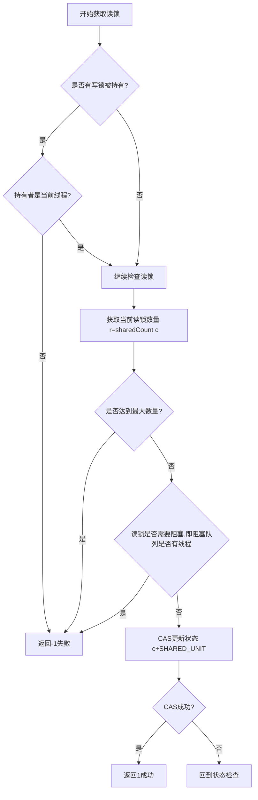

#### 7.6.2.2 获取写锁流程

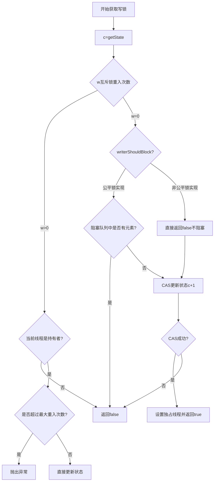

#### 7.6.2.3 释放读锁流程

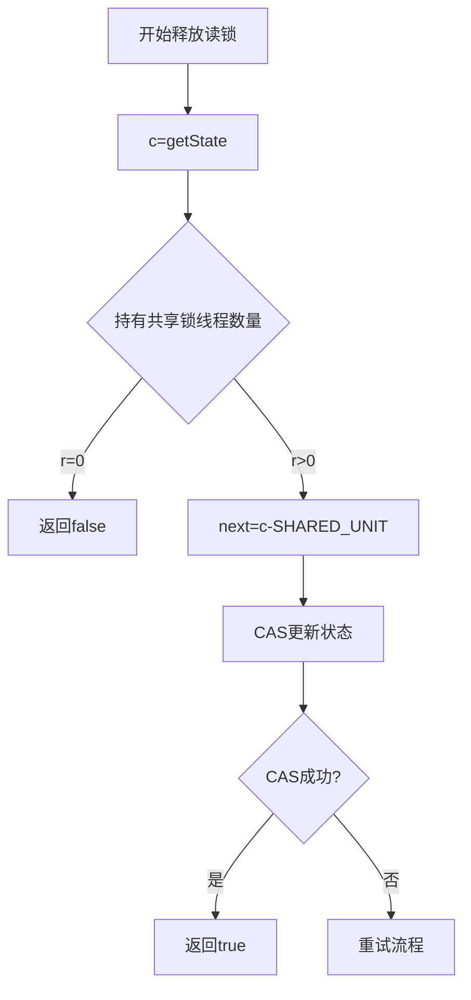

#### 7.6.2.4 释放写锁流程

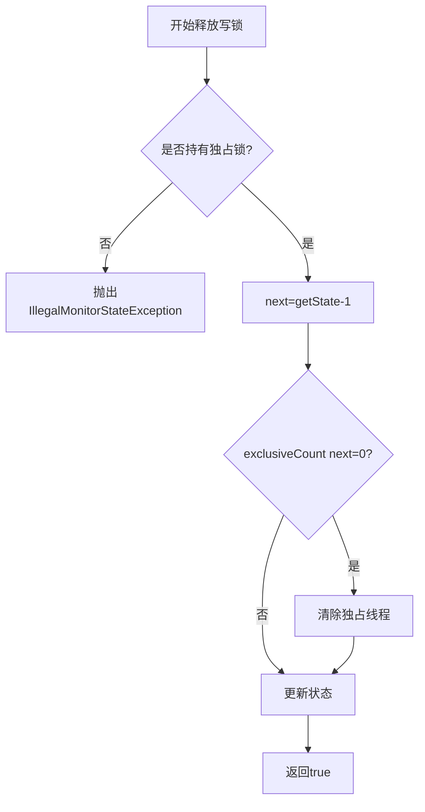

#### 7.6.2.5 公平锁与非公平锁策略对比

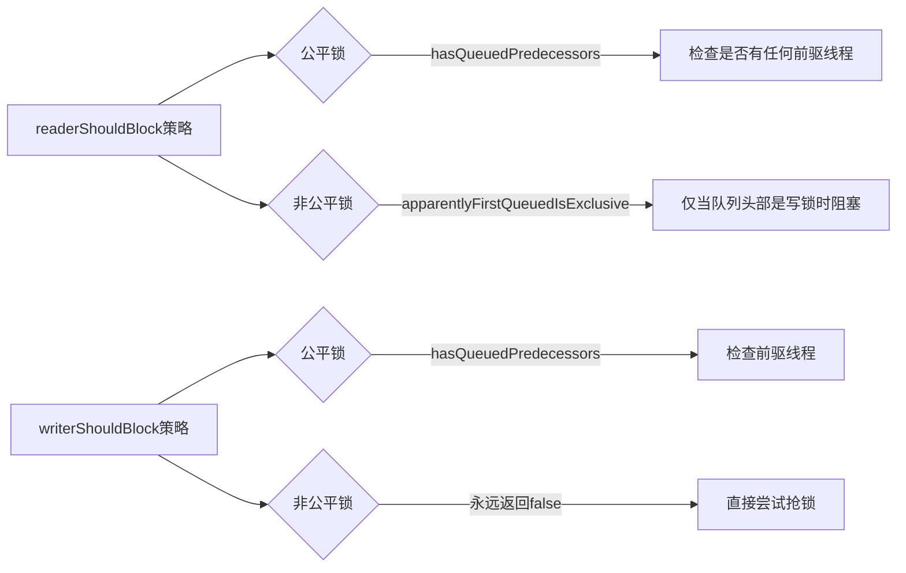

#### 7.6.2.6 代码附录

```java
import java.util.ArrayList;
import java.util.Collections;
import java.util.List;
import java.util.concurrent.CountDownLatch;
import java.util.concurrent.TimeUnit;
import java.util.concurrent.atomic.AtomicInteger;
import java.util.concurrent.locks.*;

/**
 * @author: 16404
 * @date: 2025/2/3 13:31
 **/
class ReadWriteLockFairnessTest {
    private static final int THREAD_COUNT = 100;
    private static final AtomicInteger orderCounter = new AtomicInteger(0);

    public static void main(String[] args) throws InterruptedException {
        testFairness(true);
        System.out.println("-------------------");
        testFairness(false);
    }

    private static void testFairness(boolean fair) throws InterruptedException {
        System.out.println("Testing " + (fair ? "Fair" : "Unfair") + " Lock");
        SimpleReadWriteLock lock = new SimpleReadWriteLock(fair);
        CountDownLatch startLatch = new CountDownLatch(1);
        CountDownLatch endLatch = new CountDownLatch(THREAD_COUNT);

        for (int i = 0; i < THREAD_COUNT; i++) {
            final int threadId = i;
            new Thread(() -> {
                try {
                    startLatch.await(); // 等待所有线程就绪
                    lock.writeLock().lock();
                    int order = orderCounter.incrementAndGet();
                    System.out.println("Thread " + threadId + " acquired lock, order: " + order);
                    TimeUnit.MILLISECONDS.sleep(10); // 模拟工作
                } catch (InterruptedException e) {
                    e.printStackTrace();
                } finally {
                    lock.writeLock().unlock();
                    endLatch.countDown();
                }
            }).start();
        }

        startLatch.countDown(); // 启动所有线程
        endLatch.await(); // 等待所有线程完成
        orderCounter.set(0); // 重置计数器
    }
}


public class SimpleReadWriteLock implements ReadWriteLock {
    private final ReadLock readLock;
    private final WriteLock writeLock;
    private final Sync sync;

    public SimpleReadWriteLock() {
        this(false);
    }
    public SimpleReadWriteLock(boolean fair) {
        this.sync = fair ? new FairSync() : new NonfairSync();
        readLock = new ReadLock(this);
        writeLock = new WriteLock(this);
    }

    @Override
    public Lock readLock() {
        return readLock;
    }

    @Override
    public Lock writeLock() {
        return writeLock;
    }

    /**
     * Sync是有共享锁，多线程可以同时访问
     * 有互斥锁，线程可重入的。
     */
    abstract static class Sync extends AbstractQueuedSynchronizer {
        static final int SHARED_SHIFT = 16;
        static final int SHARED_UNIT = (1 << SHARED_SHIFT);
        static final int MAX_COUNT = (1 << SHARED_SHIFT) - 1;
        // 一个共享之高SHARED_SHIFT位是读锁，低SHARED_SHIFT位是写锁
        static final int EXCLUSIVE_MASK = (1 << SHARED_SHIFT) - 1;

        /**
         * 将共享值进行无符号的左移动（高位补0），获取c的高位
         * @param c 一个共享值，高16位是共享锁，写16位是互斥锁
         * @return 获取共享线程的数量
         */
        static int sharedCount(int c) {
            return (c >>> SHARED_SHIFT);
        }

        /**
         * 将共享值与EXCLUSIVE_MASK进行与操作，获取c的低EXCLUSIVE_MASK位
         * @param c 一个共享值，高16位是共享锁，写16位是互斥锁
         * @return 获取获得互斥锁的线程重入次数
         */
        static int exclusiveCount(int c) {
            return (c & EXCLUSIVE_MASK);
        }

        abstract boolean readerShouldBlock();
        abstract boolean writerShouldBlock();

        @Override
        protected final boolean tryAcquire(int acquires) {
            Thread current = Thread.currentThread();
            int c = getState();
            int w = exclusiveCount(c);
            if (c != 0) {
                if (w == 0 || current != getExclusiveOwnerThread()) {
                    return false;
                }
                if (w + acquires > MAX_COUNT) {
                    throw new Error("Maximum lock count exceeded");
                }
                setState(c + acquires);
                return true;
            }
            if (writerShouldBlock() || !compareAndSetState(c, c + acquires)) {
                return false;
            }
            setExclusiveOwnerThread(current);
            return true;
        }

        @Override
        protected final boolean tryRelease(int releases) {
            if (!isHeldExclusively()) {
                throw new IllegalMonitorStateException();
            }
            int next = getState() - releases;
            boolean free = exclusiveCount(next) == 0;
            if (free) {
                setExclusiveOwnerThread(null);
            }
            setState(next);
            return free;
        }

        @Override
        protected final int tryAcquireShared(int unused) {
            Thread current = Thread.currentThread();
            while(true) {
                int c = getState();
                int w = exclusiveCount(c);
                if (w != 0 && getExclusiveOwnerThread() != current)
                    return -1;
                int r = sharedCount(c);
                if (readerShouldBlock() || r >= MAX_COUNT) {
                    return -1;
                }
                if (compareAndSetState(c, c + SHARED_UNIT)) {
                    return 1;
                }
            }
        }

        /**
         * tryReleaseShared 释放共享锁
         * @return 是否释放成功
         */
        @Override
        protected final boolean tryReleaseShared(int unused) {
            while(true) {
                // 一个共享值，高16位是共享锁，写16位是互斥锁
                int c = getState();
                int r = sharedCount(c);
                // 释放共享锁
                if (r == 0)
                    return false;
                int next = c - SHARED_UNIT;
                if (compareAndSetState(c, next))
                    return true;
            }
        }
        @Override
        protected final boolean isHeldExclusively() {
            return getExclusiveOwnerThread() == Thread.currentThread();
        }
        final int getReadLockCount() {
            return sharedCount(getState());
        }
    }
    static final class NonfairSync extends Sync {

        @Override
        boolean readerShouldBlock() {
            // 如果有写锁在等待,则读锁应该阻塞
            return hasQueuedThreads() && getFirstQueuedThread() != Thread.currentThread();
        }
        @Override
        boolean writerShouldBlock() {
            // 非公平模式下,写锁总是尝试获取
            return false;
        }
    }

    static final class FairSync extends Sync {
        // 对于公平锁来说，如果阻塞队列中存在线程，读写操作都需要阻塞。
        @Override
        boolean readerShouldBlock() {
            return hasQueuedPredecessors();
        }
        @Override
        boolean writerShouldBlock() {
            return hasQueuedPredecessors();
        }
    }

    public static class ReadLock extends ILock{
        private final Sync sync;
        protected ReadLock(SimpleReadWriteLock lock) {
            this.sync = lock.sync;
        }
        public void lock() {
            sync.acquireShared(1);
        }
        public void unlock() {
            sync.releaseShared(1);
        }
    }

    public static class WriteLock extends ILock{
        private final Sync sync;
        protected WriteLock(SimpleReadWriteLock lock) {
            this.sync = lock.sync;
        }
        public void lock() {
            sync.acquire(1);
        }
        public void unlock() {
            sync.release(1);
        }
        public boolean tryLock() {
            return sync.tryAcquire(1);
        }
    }
}

abstract class ILock implements Lock {

    @Override
    public void lock() { }

    @Override
    public void lockInterruptibly() throws InterruptedException { }

    @Override
    public boolean tryLock() { return false; }

    @Override
    public boolean tryLock(long l, TimeUnit timeUnit) throws InterruptedException { return false; }

    @Override
    public void unlock() { }

    @Override
    public Condition newCondition() { return null; }
}
```

### 7.6.3 阻塞队列

1. 常用阻塞队列类型:

| 队列类型              | 特性                           |
| --------------------- | ------------------------------ |
| ArrayBlockingQueue    | 基于数组的有界阻塞队列         |
| LinkedBlockingQueue   | 基于链表的可选有界阻塞队列     |
| PriorityBlockingQueue | 支持优先级的无界阻塞队列       |
| DelayQueue            | 支持延迟获取元素的无界阻塞队列 |
| SynchronousQueue      | 不存储元素的阻塞队列           |

1. 常用方法比较:

| 方法 | 抛出异常  | 返回特殊值 | 阻塞   | 超时                 |
| ---- | --------- | ---------- | ------ | -------------------- |
| 插入 | add(e)    | offer(e)   | put(e) | offer(e, time, unit) |
| 移除 | remove()  | poll()     | take() | poll(time, unit)     |
| 检查 | element() | peek()     | 不可用 | 不可用               |

SynchronousQueue和ArrayBlockingQueue区别：**ArrayBlockingQueue是通过管程法可能存储元素。SynchronousQueue是信号灯法，队列中的元素只能是0或1。**

## 7.7 线程池

**池化操作，提前建立好一系列池子用于处理，需要的时候用即可，减少了资源的创建和销毁步骤，提高程序运行效率。 **

```java
public static void main(String[] args) {
    // 当个线程池。
    ExecutorService singleThreadPool = Executors.newSingleThreadExecutor();
    // 创建一个固定大小的线程池
    ExecutorService fixedThreadPool = Executors.newFixedThreadPool(5);
    // 可伸缩的线程池
    ExecutorService cachedThreadPool = Executors.newCachedThreadPool();
    try {
        for (int i = 0; i < 10; i ++ ) {
            // 使用线程池
            cachedThreadPool.execute(()->{
                System.out.println(Thread.currentThread().getName() + "ok");
            });
        }
    } finally {
        // 线程池用完，程序结束，关闭线程池
        singleThreadPool.shutdown();
        fixedThreadPool.shutdown();
        cachedThreadPool.shutdown();
    }
}
```

**真实开发场景尽量使用ThreadPoolExecutor。**

```java
int corePoolSize = 2;
int maximumPoolSize = 5;
int keepAliveTime = 3;
TimeUnit unit = TimeUnit.SECONDS;
BlockingQueue<Runnable> workQueue = new ArrayBlockingQueue<>(3);
ThreadFactory threadFactory = Executors.defaultThreadFactory();
RejectedExecutionHandler handler = new ThreadPoolExecutor.AbortPolicy();
ThreadPoolExecutor threadPoolExecutor = new ThreadPoolExecutor(
        corePoolSize,
        maximumPoolSize,
        keepAliveTime,
        unit,
        workQueue,
        threadFactory,
        handler
);
```

**四种拒绝策略**：

| 拒绝策略            | 描述           | 行为                                                |
| ------------------- | -------------- | --------------------------------------------------- |
| AbortPolicy         | 默认的拒绝策略 | 抛出RejectedExecutionException异常                  |
| CallerRunsPolicy    | 调用者运行策略 | 在调用者的线程中直接执行被拒绝的任务                |
| DiscardPolicy       | 丢弃策略       | 静默丢弃被拒绝的任务,不做任何处理                   |
| DiscardOldestPolicy | 丢弃最旧策略   | 丢弃队列中最旧的未处理任务,然后重新尝试执行当前任务 |

## 7.8 IO和CPU密集型

| 方面     | IO密集型                                   | CPU密集型                 |
| -------- | ------------------------------------------ | ------------------------- |
| 资源需求 | 主要消耗I/O资源                            | 主要消耗CPU资源           |
| 并发策略 | 可以使用更多线程，因为线程经常处于等待状态 | 线程数通常不超过CPU核心数 |
| 性能瓶颈 | I/O操作速度                                | CPU处理速度               |
| 优化重点 | 减少I/O等待时间，提高I/O吞吐量             | 提高CPU利用率，优化算法   |

## 7.9 四大函数式接口（JDK8新特性）

### 7.9.1 函数式接口

**只有一个方法的接口，有返回值有入参，输入和输出都需要是包装类。**

```java
Function function = new Function<String, String>() {
    @Override
    public String apply(String o) {
        return o;
    }
};
// 简化
Function function = (str)->{return str;};
```

### 7.9.2 断定型接口

**实际上就算返回值固定未boolean类型的函数式接口。**

```java
Predicate<String> predicate = new Predicate<>() {
    @Override
    public boolean test(String s) {
        return s.equals("test");
    }
};
// 简化
Predicate<String> predicate = (o)->o.equals("test");
```

### 7.9.3 生产者接口

**没有输入只有返回值。**

```java
Supplier<String> supplier = new Supplier<>() {
    @Override
    public String get() {
        return "yes";
    }
};
Supplier<String> supplier = () -> "yes";
```

### 7.9.4 消费者接口

**消费者接口只有输入没有返回值。**

```java
Consumer<Object> consumer = new Consumer<>() {
    @Override
    public void accept(Object o) {
        System.out.println("consumer");
    }
};
Consumer<Object> consumer = o -> System.out.println("consumer");
```

### 7.9.5 总结

- **函数式接口，有输入有输出，输入和输出都需要是包装类。**
- **消费者接口，有输入没输出，输入需要是包装类。**
- **生产者接口，有输出没输入，输出需要是包装类。**
- **断定型接口，有输入有输出，输出是固定的基本类型boolean、输入是包装类。**

## 7.10 Stream流式计算

大数据：存储+计算

存储：集合、MySQL

**计算都应该交给流来操作。**

```java
/**
 * @author: 16404
 * @date: 2025/2/3 11:07
 **/
public class Test {
    public static void main(String[] args) {
        User u1 = new User(1, "a", 21);
        User u2 = new User(2, "b", 22);
        User u3 = new User(3, "c", 23);
        User u4 = new User(4, "d", 24);
        User u5 = new User(6, "e", 25);
        /**
         * 任务筛选用户
         * 1. ID 是偶数
         * 2. 年龄大于23
         * 3. 用户名转为大写
         * 4. 按用户名倒序排列
         * 5. 只输出第一个用户
         */
        // 集合就算存储
        List<User> list = Arrays.asList(u1, u2, u3, u4, u5);
        // 计算交给Stream流
        Stream<User> limit = list.stream().filter(u -> (u.id % 2 == 0 && u.age > 23))
                .map((u) -> {
                    u.name = u.name.toUpperCase();
                    return u;
                })
                .sorted((o1, o2) -> o2.name.compareTo(o1.name))
                .limit(1);
    }
}
class User {
    public Integer id;
    public String name;
    public Integer age;

    public User(int i, String a, int i1) {
        this.id = i;
        this.name = a;
        this.age = i1;
    }
    @Override
    public String toString() {
        return "User(id="+id+", name="+name+", age="+age+")";
    }
}
```

## 7.11 ForkJoin分支合并

对于多线程执行的小任务进行分支合并。

**ForkJoin特点：工作窃取（内部维护的是一个双端队列）**

**例如多个线程执行各自的任务列表，A线程执行速度较忙，B线程执行速度较快。B线程已经执行完毕，此时A线程还未完成，B线程就可以执行A线程未执行的任务。**

**线程窃取是从其他队列的尾部窃取（FIFO）。**

**`fork()` 操作将任务压入当前线程双端队列的头部（LIFO）。**

**`join()` 操作会触发工作窃取机制：在等待子任务结果时，线程优先处理本地队列头部的任务，或窃取其他队列尾部的任务。**

在ForkJoin框架中，双端队列和工作窃取算法协同工作以高效执行并行任务。以下是结合代码的详细解释：

1. **任务拆分与双端队列**

   在`ForkJoinDemo`的`compute`方法中，当任务范围超过阈值（`temp`）时，任务会被拆分为两个子任务（`task1`和`task2`）：

   ```java
   ForkJoinDemo task1 = new ForkJoinDemo(start, middle);
   task1.fork(); // 子任务1入队
   ForkJoinDemo task2 = new ForkJoinDemo(middle + 1, end);
   task2.fork(); // 子任务2入队
   ```

2. **工作窃取机制**

   **本地任务处理**：线程优先从自己队列的**头部**取出任务执行（快速处理最新任务，减少内存访问延迟）。

   **窃取其他队列**：当线程的队列为空时，它会随机选择其他线程，从其队列的**尾部**窃取任务（FIFO顺序），避免与受害者线程竞争头部。

   **示例场景：**

   - **线程A**拆分任务后，队列中有`task1`和`task2`。
   - **线程A**执行`task1.join()`时，会先处理本地队列中的`task1`。
   - 若**线程B**空闲，它会从线程A队列的**尾部**窃取`task2`并执行。
   - 这样，`task1`和`task2`并行处理，加速计算。

3. **`join()`的协作处理**

   **优化等待**：当线程调用`join()`等待子任务结果时，它不会阻塞，而是优先处理本地队列中的其他任务或窃取任务，保持CPU忙碌。

   例如，线程A在等待`task1.join()`时，可能先执行其他任务（如`task2`），或窃取其他线程的任务。

4. **性能优势**

   **减少竞争**：双端队列的头尾分离设计降低了线程间竞争。

   **负载均衡**：工作窃取自动平衡负载，空闲线程帮助忙碌线程完成任务。

   **递归并行**：大任务不断拆分为小任务，直到阈值以下，形成高效并行树。

```java
import java.util.concurrent.ExecutionException;
import java.util.concurrent.ForkJoinPool;
import java.util.concurrent.ForkJoinTask;
import java.util.concurrent.RecursiveTask;
import java.util.stream.LongStream;

/**
 * @author: 16404
 * @date: 2025/2/4 14:36
 **/

public class Test {
    public static void main(String[] args) {
        /**
         * 求和计算的任务！
         * 如何使用 forkjoin
         * 1. forkjoinPool 通过它执行
         * 2. 计算任务 forkjoinPool.execute
         * 3. 计算类需要继承 ForkJoinTask
         */
        test1();
        test2();
        test3();
        /**
         * test1 sum=500000000500000000, 时间：852
         * test2 sum=500000000500000000, 时间：215
         * test3 sum=500000000500000000, 时间：132
         */
    }

    /**
     * 普通方法求和
     */
    public static void test1() {
        long sum = 0;
        long start = System.currentTimeMillis();
        for (long i = 1; i <= 1e9; i ++ ) {
            sum += i;
        }
        long end = System.currentTimeMillis();
        System.out.println("sum="+sum+", 时间："+(end - start));
    }

    /**
     * forkJoin
     */
    public static void test2() {
        long start = System.currentTimeMillis();
        ForkJoinPool forkJoinPool = new ForkJoinPool();
        ForkJoinDemo forkJoinTask = new ForkJoinDemo(0L, (long) 1e9);
        ForkJoinTask<Long> submit = forkJoinPool.submit(forkJoinTask);
        Long sum = null;
        try {
            sum = submit.get();
        } catch (InterruptedException e) {
            throw new RuntimeException(e);
        } catch (ExecutionException e) {
            throw new RuntimeException(e);
        }
        long end = System.currentTimeMillis();
        System.out.println("sum="+sum+", 时间："+(end - start));
    }
    public static void test3() {
        long start = System.currentTimeMillis();
        // Stream 并行流
        long sum = LongStream.rangeClosed(1L, (long) 1e9).parallel().reduce(0, Long::sum);
        long end = System.currentTimeMillis();
        System.out.println("sum="+sum+", 时间："+(end - start));
    }
}

class ForkJoinDemo extends RecursiveTask<Long> {
    private Long start;
    private Long end;
    // 临界值
    private Long temp = 10000L;

    public ForkJoinDemo(Long start, Long end) {
        this.start = start;
        this.end = end;
    }

    // 计算方法
    @Override
    protected Long compute() {
        if ((end - start) < temp) {
            long sum = 0;
            for (long i = start; i <= end; i ++ ) {
                sum += i;
            }
            return sum;
        } else { // forkJoin
            // 并行计算
            long middle = (start + end) >> 1;
            ForkJoinDemo task1 = new ForkJoinDemo(start, middle);
            task1.fork(); // 拆分任务，把任务压入线程队列
            ForkJoinDemo task2 = new ForkJoinDemo(middle + 1, end);
            task2.fork(); // 拆分任务，把任务压入线程队列
            long res = task1.join() + task2.join();
            return res;
        }
    }
}
```

## 7.12 异步回调

Future：可以对将来某个事件的结果进行建模。

### 7.12.1 无返回值的异步回调

下面代码执行结果如下：

```
主线程开始执行
主线程执行中...
开始执行异步任务
异步任务执行完成
主线程获取到了异步任务的返回值
```

```java
public static void main(String[] args) {
    // 发起一个请求
    System.out.println("主线程开始执行");
    CompletableFuture<Void> future = CompletableFuture.runAsync(() -> {
        try {
            System.out.println("开始执行异步任务");
            Thread.sleep(1000);
            System.out.println("异步任务执行完成");
        } catch (InterruptedException e) {
            throw new RuntimeException(e);
        }
    });
    System.out.println("主线程执行中...");
    try {
        future.get();
    } catch (InterruptedException e) {
        throw new RuntimeException(e);
    } catch (ExecutionException e) {
        throw new RuntimeException(e);
    }
    System.out.println("主线程获取到了异步任务的返回值");
}
```

### 7.12.2 有返回值的异步回调

**whenComplete((t, u)->{...}其中t是返回值，u是异步任务报错的结果。**

**exceptionally可以捕获异步回调中的异常，通过编写lambda表达式处理异常。**

```java
public static void main(String[] args) throws ExecutionException, InterruptedException {
    CompletableFuture<Integer> completableFuture = CompletableFuture.supplyAsync(() -> {
        System.out.println(Thread.currentThread().getName() + "supplyAsync=>Integer");
        int i = 2 / 0;
        return 200;
    });
    Integer res = completableFuture.whenComplete((t, u) -> {
        System.out.println("t=>" + t);
        System.out.println("u=>" + u);
    }).exceptionally((e) -> {
        e.printStackTrace();
        return 404;
    }).get();
    System.out.println(res);
}
```

## 7.13 JMM

### 7.13.1 JMM八大原子操作

JMM：是java内存模型。

JMM一些同步约定：

1. **线程解锁前，必须把共享变量立刻刷回主存。**
2. **线程加锁前，必须读取主存中的最新值到工作内存中！**
3. **加锁和解锁是同一把锁**

8大操作如图下所示，**1.read、2.load、3.use、4.assign、5.write、6.store、7.lock、8.unlock.**

①lock(锁定)：作用于主内存的变量，将主内存变量加锁。它把一个变量标识为一条线程独占的状态。

②unlock(解锁)：作用于主内存的变量，将主内存变量解锁。它把一个处于锁定状态的变量释放出来，释放后的变量才可以被其他线程锁定。

③read(读取)：作用于主内存的变量，从主内存中读取数据。它把一个变量的值从主内存传输到线程的工作内存中，以便随后的load动作使用。

④load(载入)：作用于工作内存的变量，它把read操作从主内存中得到的变量值放入工作内存的变量副本中。

⑤use(使用)：作用于工作内存的变量，它把工作内存中一个变量的值传递给执行引擎，每当虚拟机遇到一个需要使用变量的值的字节码指令时将会执行这个操作。

⑥assign(赋值)：作用于工作内存的变量，它把一个从执行引擎接收的值赋给工作内存的变量，每当虚拟机遇到一个给变量赋值的字节码指令时执行这个操作。

⑦store(存储)：作用于工作内存的变量，它把工作内存中一个变量的值传送到主内存中，以便随后的write操作使用。

⑧write(写入)：作用于主内存的变量，它把store操作从工作内存中得到的变量的值放入主内存的变量中。

**存在问题：线程B修改了值在没有执行store操作时，线程A不能及时看见，导致线程A读取flag是旧值。**

**JMM进行约定要求read和load、store和write操作需要成对出现。**

### 7.13.2 经典死循环问题

主线程和开启后的子线程属于两个线程。

在启动子线程的时候num=0，在主线程执行1秒后将num赋值为1，为什么子线程没有停下来？

**因为子线程在num赋值为1之前，将num的值通过read和load操作写入了工作内存，执行引擎得到的值一直都是本地工作内存中的值，也就是num=0.**

```java
public class Test {
    private static int num = 0;
    public static void main(String[] args) {
        new Thread(()->{
            while (num == 0) {

            }
        }).start();
        try {
            Thread.sleep(1000);
        } catch (InterruptedException e) {
            throw new RuntimeException(e);
        }
        num = 1;
        System.out.println(num);
    }
}
```

如何让子线程知道主内存中的值修改了？

## 7.14 Volatile

### 7.14.1 Volatile三大特性

**保证可见性：**当写一个volatile变量时，JMM会把线程对应的本地内存中的共享变量立刻刷新回到主存中。当读取一个volatile变量时，JMM会把该线程对应的工作内存设置为无效，直接从主存中读取共享变量。

**不保证原子性：**

**禁止指令重排：**volatile保证可见性和有序性就是靠的内存屏障实现的。编译器对代码进行编译的时候为了提供程序执行的效率，会在保证在单线程下结果一致的情况下，对指令进行重排序。加上了volatile关键字的时候，Java编译器在生成JVM指令时插入特定的内存屏障指令，就是为了保证**内存屏障之前**的所有**写操作都要回写到主内存**，**内存屏障之后**的所有**读操作**都能获得内存屏障之前的所有写操作的**最新结果**(实现了可见性)。所以在一定程度上需要禁止重排。

**为什么CPU会对指令进行重排呢？**

计算机中执行一条指令所需要的时间是指令周期，指令周期可以划分为五个机器周期（取指、译码、执行、访存、写回），每个机器周期包含若干时钟周期，例如访存的时钟周期数量高于取值的时钟周期。

目前CPU架构都是多核架构，指令通过流水线并行的执行，如果有两个CPU核同时访问主存，其中一个就需要等待。为了提高效率，CPU就会进行对指令进行重拍。例如A核访存期间，B核执行取指。

**内存屏障的分类：**

|      屏障类型      |         指令示例         |                             说明                             |
| :----------------: | :----------------------: | :----------------------------------------------------------: |
|  LoadLoad（读读）  |  Load1；LoadLoad；Load2  |       保证load1的读取操作在load2及后续读取操作之前执行       |
| StoreStore（写写） | Store1；LoadLoad；Store2 | 在store2及其后的写操作执行前，保证store1的写操作已刷新到主内存 |
| LoadStore（读写）  | Load1；LoadLoad；Store2  |  在store2及其后的写操作执行前，保证load1的读操作已读取结束   |
| StoreLoad（写读）  | Store1；LoadLoad；Load2  | 保证store1的写操作已刷新到主内存之后，load2及其后的读操作才能执行 |

### 7.14.2 volatile应用

在7.13.2 经典死循环问题引入了，如何让子线程知道主内存中的值修改了？

**在num之前加上volatile！**

```java
private volatile static int num = 0;
```

**Volatile不保证原子性！**

`volatile` 的核心作用之一就是确保线程**从主内存中获取变量的最新值**，而不是从线程的**工作内存**（如 CPU 缓存或寄存器）中读取可能过期的值。在下面代码中num最终的值不会等于20000，因为num++在字节码中是三条指令。

线程A先从主存中读取num，然后对其进行++，之后写回主存。但是在写回之前，线程B也读取了num，进行++。然后线程B执行完++操作后线程A和B一次写回。此时就出现了数据的不一致。

```java
/**
 * @author: 16404
 * @date: 2025/2/4 14:36
 **/

public class Test {
    private volatile static int num = 0;
    public static void add() {
        /**
         * num ++ 在字节码中是三条指令
         * 1. 获取num
         * 2. num加一
         * 3. 写回num
         */
        num ++ ;
    }
    public static void main(String[] args) {
        for (int i = 1; i <= 20; i ++ ) {
            new Thread(()->{
                for (int j = 0; j < 1000; j ++ ) {
                    add();
                }
            }).start();
        }

        while (Thread.activeCount() > 2) {
            Thread.yield();
        }
        System.out.println(num);
    }
}
```

## 7.15 AtomicInteger

上面提到volatile无法保证原子性，如何保证原子性呢？

通过new一个AtomicInteger对象，调用getAndIncrement()方法，代替num++的操作。**这个方法底层使用的是CAS**。

把num++改为下面代码。

```java
private volatile static AtomicInteger num = new AtomicInteger(0);
public static void add() {
    // 使用CAS乐观锁
    num.getAndIncrement(); // 加一方法
}
```

## 7.16 指令重排

**源码--->编译器优化重排--->指令并行重排--->内存系统重排--->执行。**

```java
int x = 1; // 1
int y = 2; // 2
x = x + 5; // 3
y = x * x; // 4
```

我们所期望的是：1234，但是可能会出现2134等情况。

但是不可能是4123，因为编译器会考虑依赖关系。

**指令重排可能造成影响的结果**：a b x y默认是0

| 线程A | 线程B |
| ----- | ----- |
| x=a   | y=b   |
| b=1   | a=2   |

正常结果是：x=0，y=0.

**由于指令重排可能导致指令如下：**

| 线程A | 线程B |
| ----- | ----- |
| b=1   | a=2   |
| x=a   | y=b   |

此时x=2，y=1；

**这不是期望的x=y=0。**

**volatile可以避免指令重排**

内存屏障。CPU指令

1.可以保证特点的操作的执行顺序

2.可以保证某些变量的内存可见性

## 7.17 单例模式

### 7.17.1 饿汉式

**在类加载阶段直接就创建一个对象。**

```java
class Hungry{
    // 可能会浪费空间
    private byte[] data1 = new byte[1 << 20];
    private byte[] data2 = new byte[1 << 20];
    private byte[] data3 = new byte[1 << 20];
    private byte[] data4 = new byte[1 << 20];

    private Hungry() {

    }
    private final static Hungry HUNGRY = new Hungry();

    public static Hungry getInstance() {
        return HUNGRY;
    }
}
```

### 7.17.2 DCL懒汉式

**DCL懒汉式下，多线程并发操作会出现问题，导致多次执行构造函数，导致资源浪费**。如下面代码所示。执行下面代码时，构造函数中的println方法会被多次调用，表示实例被多次创建，这不是我们希望的单例模式。

```java
public class Test {
    public static void main(String[] args) {
        for (int i = 0; i < 10; i ++ ) {
            new Thread(()->{
                LazyMan.getInstance();
            }, String.valueOf(i)).start();
        }
    }
}
class LazyMan {
    // 私有构造函数，防止外部实例化
    private LazyMan() {
        System.out.println("LazyMan" + Thread.currentThread().getName() + "ok");
    }
    private static LazyMan lazyMan;
    // 双重检查锁定模式的懒汉式单例
    public static LazyMan getInstance() {
        if (lazyMan == null) {
            lazyMan = new LazyMan();
        }
        return lazyMan;
    }
}
```

导致构造方法多次调用的原因如下：多线程并发的情况下，在第一个LazyMan还未被创建出来的时候，多个线程已经通过if语句，并且new LazyMan()是一个执行速度较慢的操作，因为涉及到内存的分配。

接下来对getInstance方法进行修改：

**通过对方法进行加锁，来解决上面的问题。**

但是又带来了性能的问题，例如lazyMan已经被创建出来了，但是每次都需要加锁，并行的程序编程串行执行，**性能太差。如何解决？**

```java
public synchronized static LazyMan getInstance() {
    if (lazyMan == null) {
        lazyMan = new LazyMan(); // 不是原子性操作
    }
    return lazyMan;
}
```

通过使用双重检查锁定模式来解决，在lazyMan未被创建的时候，会因为lazyMan为null导致锁的多次获取，**但是一但不为null时，就不再需要获取锁**。

```java
// 双重检查锁定模式的懒汉式单例
public static LazyMan getInstance() {
    if (lazyMan == null) {
        synchronized (LazyMan.class) {
            if (lazyMan == null) {
                lazyMan = new LazyMan(); // 不是原子性操作
            }
        }
    }
    return lazyMan;
}
```

但是代码还是会存在小问题。**因为lazyMan = new LazyMan();这一条语句实际上是3条指令**。CPU在做指令优化的时候会进行指令指令重排。JVM 可能会对 `lazyMan = new LazyMan();` 这行代码进行指令重排。具体来说，JVM 可能会先分配内存空间，然后将对象引用赋值给 `lazyMan`，最后再执行构造方法。**这可能导致其他线程在对象未完全初始化时就访问到 `lazyMan`，从而导致程序出错**。

```
lazyMan = new LazyMan();
* 1. 分配内存空间。
* 2. 执行构造方法，初始化对象。
* 3. 将对象引用赋值给 lazyMan。
```

**解决办法采用volatile关键字。**

```java
/**
 * 使用 volatile 关键字确保多线程环境下的可见性和防止指令重排。
 * 在 DCL（双重检查锁定）模式中，volatile 是必要的，因为 new LazyMan() 不是原子操作。
 * 1. 分配内存空间。
 * 2. 执行构造方法，初始化对象。
 * 3. 将对象引用赋值给 lazyMan。
 * 如果没有 volatile，JVM 可能会重排指令，导致其他线程看到未完全初始化的对象。
 */
private volatile static LazyMan lazyMan;
```

### 7.17.3 静态内部类

```java
class Holder {
    private Holder() {

    }

    public static Holder getInstance() {
        return InnerClass.HOLDER;
    }

    public static class InnerClass{
        private static final Holder HOLDER = new Holder();
    }
}
```

### 7.17.4 **防止单例模式被破坏的最佳实践**

利用枚举类实现单例模式是**防止单例模式被破坏的最佳实践**

无论是饿汉式、懒汉式还是静态内部类都是不安全的。

因为Java存在反射机制，可以通过反射函数机制破坏类的私有属性，例如在获取类对象的时候，设置私有构造函数是可以访问的setAccessible(true)，而从利用反射机制的newInstance()就可以创建一个新的对象。

如何解决？利用枚举类。

- **线程安全**：枚举类的实例是由 JVM 在类加载时创建的，且只会创建一次，因此天然是线程安全的。
- **防止反射攻击**：枚举类的构造函数是私有的，且 JVM 会阻止通过反射创建枚举实例，因此无法通过反射破坏单例。
- **防止序列化破坏**：枚举类的序列化和反序列化由 JVM 保证，不会创建新的实例，因此可以防止序列化破坏单例。

```java
public enum Singleton {
    INSTANCE; // 单例实例

    // 可以添加其他方法
    public void doSomething() {
        System.out.println("Singleton is doing something!");
    }
}
public class Main {
    public static void main(String[] args) {
        // 获取单例实例
        Singleton singleton = Singleton.INSTANCE;
        singleton.doSomething();

        // 验证单例
        Singleton anotherSingleton = Singleton.INSTANCE;
        System.out.println(singleton == anotherSingleton); // 输出 true，说明是同一个实例
    }
}
```

**枚举单例的优势**

（1）**线程安全**

- 枚举类的实例是在类加载时创建的，由 JVM 保证线程安全，无需额外的同步机制。

（2）**防止反射攻击**

- 枚举类的构造函数是私有的，且 JVM 会阻止通过反射创建枚举实例。以下代码会抛出异常：

  java

  复制

  ```java
  Constructor<Singleton> constructor = Singleton.class.getDeclaredConstructor();
  constructor.setAccessible(true);
  Singleton newInstance = constructor.newInstance(); // 抛出异常：Cannot reflectively create enum objects
  ```

（3）**防止序列化破坏**

- 枚举类的序列化和反序列化由 JVM 保证，不会创建新的实例。以下代码验证了这一点：

  java

  复制

  ```java
  // 序列化
  ObjectOutputStream out = new ObjectOutputStream(new FileOutputStream("singleton.ser"));
  out.writeObject(Singleton.INSTANCE);
  out.close();
  
  // 反序列化
  ObjectInputStream in = new ObjectInputStream(new FileInputStream("singleton.ser"));
  Singleton deserializedSingleton = (Singleton) in.readObject();
  in.close();
  
  System.out.println(Singleton.INSTANCE == deserializedSingleton); // 输出 true，说明是同一个实例
  ```

5. **枚举单例的局限性**

- **无法延迟加载**：枚举类的实例是在类加载时创建的，无法实现懒加载（Lazy Initialization）。
- **无法继承**：枚举类不能继承其他类（但可以实现接口）。

## 7.18 深入理解CAS

### 7.18.1 CAS在原子类中的使用

例如原子类中的getAndIncrement方法，方法中使用getAndAddInt，这个方法就使用了CAS。**CAS：比较当前工作内存中的值和主存中的值，如果这个值是期望的，那么就执行！如果不是就一直循环。**

```java
public final int getAndIncrement() {
    return U.getAndAddInt(this, VALUE, 1);
}
@IntrinsicCandidate
public final int getAndAddInt(Object o, long offset, int delta) {
    int v;
    do {
        v = this.getIntVolatile(o, offset);
    } while(!this.weakCompareAndSetInt(o, offset, v, v + delta));

    return v;
}
```

缺点：

- 循环会耗时
- 一次性只能保证一个共享的原子性
- ABA问题

### 7.18.2 ABA问题

什么是ABA问题，如何解决：**引入版本号**！

在多线程场景下`CAS`会出现`ABA`问题，关于ABA问题这里简单科普下，例如有2个线程同时对同一个值(初始值为A)进行CAS操作，这三个线程如下

1. 线程1，期望值为A，欲更新的值为B
2. 线程2，期望值为A，欲更新的值为B

线程`1`抢先获得CPU时间片，而线程`2`因为其他原因阻塞了，线程`1`取值与期望的A值比较，发现相等然后将值更新为B，然后这个时候**出现了线程`3`，期望值为B，欲更新的值为A**，线程3取值与期望的值B比较，发现相等则将值更新为A，此时线程`2`从阻塞中恢复，并且获得了CPU时间片，这时候线程`2`取值与期望的值A比较，发现相等则将值更新为B，虽然线程`2`也完成了操作，但是线程`2`并不知道值已经经过了`A->B->A`的变化过程。

**`ABA`问题带来的危害**：

 小明在提款机，提取了50元，因为提款机问题，有两个线程，同时把余额从100变为50

 线程1（提款机）：获取当前值100，期望更新为50，

 线程2（提款机）：获取当前值100，期望更新为50，

 线程1成功执行，线程2某种原因block了，这时，某人给小明汇款50

 线程3（默认）：获取当前值50，期望更新为100，

 这时候线程3成功执行，余额变为100，

 线程2从Block中恢复，获取到的也是100，compare之后，继续更新余额为50！！！

 此时可以看到，实际余额应该为100（100-50+50），但是实际上变为了50（100-50+50-50）这就是ABA问题带来的成功提交。

**解决方法**： 在变量前面加上版本号，每次变量更新的时候变量的**版本号都`+1`**，即`A->B->A`就变成了`1A->2B->3A`。

### 7.18.3 原子引用

**通过原子应用的类，通过添加版本号实现。**

```java
public static void main(String[] args) {
    Integer init = 2020;
    AtomicStampedReference<Integer> atomicInteger = new AtomicStampedReference<>(init, 1);
    new Thread(()->{
        Integer tmp = 2022;
        System.out.println("a1=>" + atomicInteger.getStamp());
        try {
            Thread.sleep(200);
        } catch (InterruptedException e) {
            throw new RuntimeException(e);
        }
        atomicInteger.compareAndSet(init, tmp,
                atomicInteger.getStamp(), atomicInteger.getStamp()+1);
        System.out.println("a2=>" + atomicInteger.getStamp());
        atomicInteger.compareAndSet(tmp, init,
                atomicInteger.getStamp(), atomicInteger.getStamp()+1);
        System.out.println("a3=>" + atomicInteger.getStamp());

    }, "a").start();

    new Thread(()->{
        Integer end = 6666;
        System.out.println("b1=>" + atomicInteger.getStamp());
        try {
            Thread.sleep(100);
        } catch (InterruptedException e) {
            throw new RuntimeException(e);
        }
        atomicInteger.compareAndSet(init, end,
                atomicInteger.getStamp(), atomicInteger.getStamp()+1);
        System.out.println("b2=>" + atomicInteger.getStamp());
    }, "b").start();
}
```

**一些小坑**

compareAndSet函数内部是使用==号进行比较的，测试的时候使用Integer的时候出现了错误。

```java
AtomicStampedReference<Integer> atomicInteger = new AtomicStampedReference<>(2024, 1); // ①
atomicInteger.compareAndSet(2024, 2025, atomicInteger.getStamp(), atomicInteger.getStamp()+1); // ②
atomicInteger.compareAndSet(2025, 2024, atomicInteger.getStamp(), atomicInteger.getStamp()+1); // ③
System.out.println(atomicInteger.getStamp()+1); // 最后等于1
```

**上面的代码执行结果版本号最终会等于1！这是为什么？**

**版本号等于1说明cas一次都没执行成功**，因为在声明atomicInteger的时候使用的是Integer包装类。JVM规定了当Integer值在-128到127之间，Integer声明的变量指向的是常量池中的值，这个值是全局唯一的。如果不在这个区间，JVM会创建一个新的Integer对象，所以第②行代码和第三行代码中虽然写的都是2025，**但传入函数compareAndSet中的expectedReference和newReference是两个不同的地址。所以交换失败。**

```java
AtomicStampedReference<Integer> atomicInteger = new AtomicStampedReference<>(4, 1); // ①
atomicInteger.compareAndSet(4, 5, atomicInteger.getStamp(), atomicInteger.getStamp()+1); // ②
atomicInteger.compareAndSet(5, 4, atomicInteger.getStamp(), atomicInteger.getStamp()+1); // ③
System.out.println(atomicInteger.getStamp()+1); // 最后等于3
```

这样修改到-128到127之间就可以成功交换了。

```java
public boolean compareAndSet(V expectedReference, V newReference, int expectedStamp, int newStamp) {
    Pair<V> current = this.pair;
    return expectedReference == current.reference && expectedStamp == current.stamp && (newReference == current.reference && newStamp == current.stamp || this.casPair(current, AtomicStampedReference.Pair.of(newReference, newStamp)));
}
```

## 7.19 各种锁的理解

### 7.19.1 公平锁、非公平锁

公平锁：FIFO，利用队列。

非公平锁：默认都是非公平的。

### 7.19.2 可重入锁（递归锁）

通过线程可以多次获取锁。

### 7.19.3 自旋锁

```java
public class Test {
    public static void main(String[] args) throws InterruptedException {
        SpinlockDemo lock = new SpinlockDemo();
        new Thread(()->{
            lock.lock();
            try {
                Thread.sleep(300);
            } catch (InterruptedException e) {
                throw new RuntimeException(e);
            } finally {
                lock.unlock();
            }
        }, "T1").start();
        Thread.sleep(10);
        new Thread(()->{

            lock.lock();
            try {
                Thread.sleep(100);
            } catch (InterruptedException e) {
                throw new RuntimeException(e);
            } finally {
                lock.unlock();
            }
        }, "T2").start();
    }
}

class SpinlockDemo {
    AtomicReference<Thread> atomicReference = new AtomicReference<>();
    // 加锁
    public void lock() {
        Thread thread = Thread.currentThread();
        System.out.println(thread.getName() + "==>lock");
        int sum = 0;
        while (!atomicReference.compareAndSet(null, thread)) {
            sum ++ ;
            if (sum %20 == 0) System.out.println((thread.getName()+"尝试自旋加锁"));
        }
    }

    // 解锁
    public void unlock() {
        Thread thread = Thread.currentThread();
        System.out.println(thread.getName() + "==>unlock");
        atomicReference.compareAndSet(thread, null);
    }
}
```

### 7.19.4 死锁排查

死锁代码

```java
public class Test {
    public static void main(String[] args) throws InterruptedException {
        Lock lock1 = new ReentrantLock();
        Lock lock2 = new ReentrantLock();
        new Thread(()->{
            lock1.lock();
            try {
                Thread.sleep(100);
                lock2.lock();
            } catch (InterruptedException e) {
                throw new RuntimeException(e);
            } finally {
                lock2.unlock();
                lock1.unlock();
            }
        }).start();

        new Thread(()->{
            lock2.lock();
            try {
                Thread.sleep(100);
                lock1.lock();
            } catch (InterruptedException e) {
                throw new RuntimeException(e);
            } finally {
                lock1.unlock();
                lock2.unlock();
            }
        }).start();
    }
}
```

1.使用 jps -l 定位进程号

```
22896 org.jetbrains.jps.cmdline.Launcher
35544 com.intellij.idea.Main
39116 Test
41484 jdk.jcmd/sun.tools.jps.Jps
PS D:\project\java_project\handwritten_framework\Simple-implementation-of-Java-framework-or-component\SimpleThreadPool\out\production\SimpleThreadPool> jstack 39116
2025-02-05 16:34:45
Full thread dump OpenJDK 64-Bit Server VM (21.0.2+13-58 mixed mode, sharing):  
```

2.使用 jstack 进程号找到死锁问题

```
Found one Java-level deadlock:

"Thread-0":
  waiting for ownable synchronizer 0x00000005abccac28, (a java.util.concurrent.locks.ReentrantLock$NonfairSync),
  which is held by "Thread-1"

entrantLock.java:153)
        at java.util.concurrent.locks.ReentrantLock.lock(java.base@21.0.2/ReentrantLock.java:322)
        at Test.lambda$main$1(Test.java:30)
        at Test$$Lambda/0x0000027d59003420.run(Unknown Source)
        at java.lang.Thread.runWith(java.base@21.0.2/Thread.java:1596)
        at java.lang.Thread.run(java.base@21.0.2/Thread.java:1583)

Found 1 deadlock.
```

