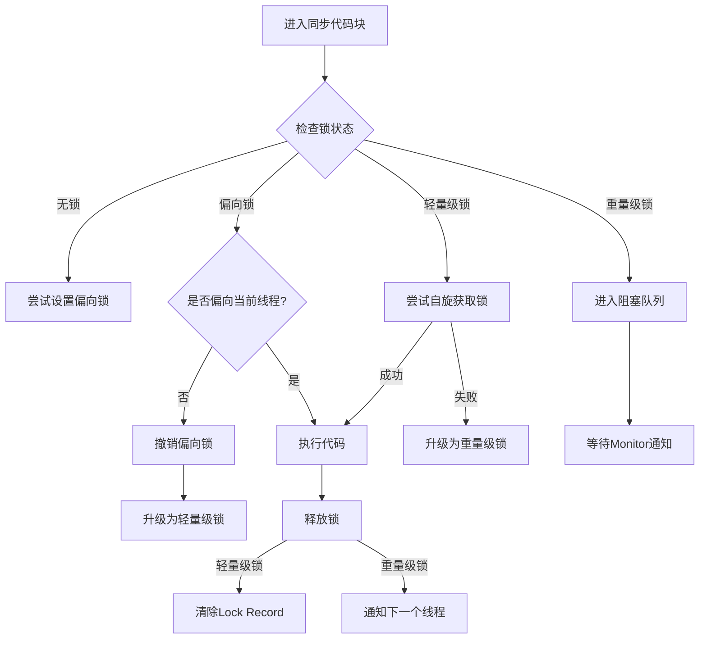
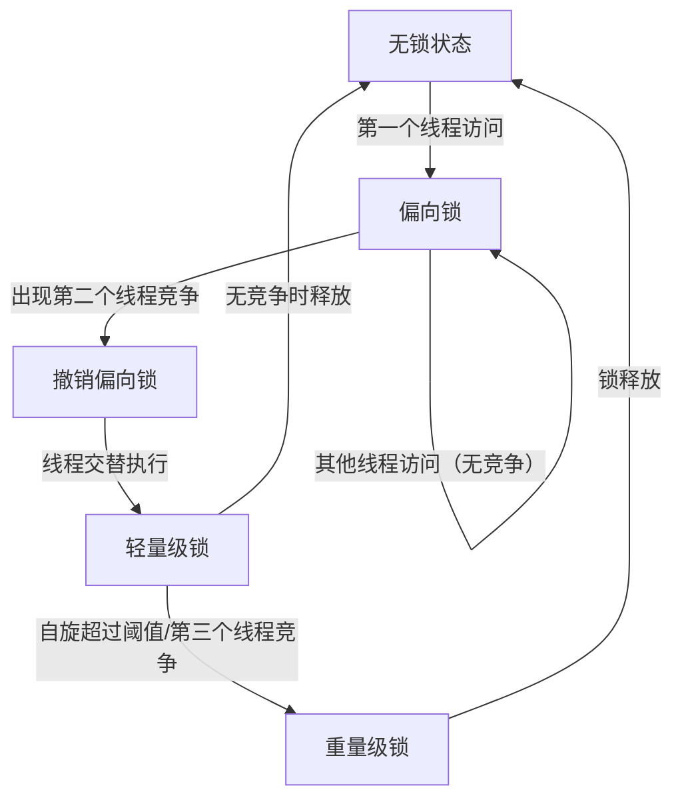
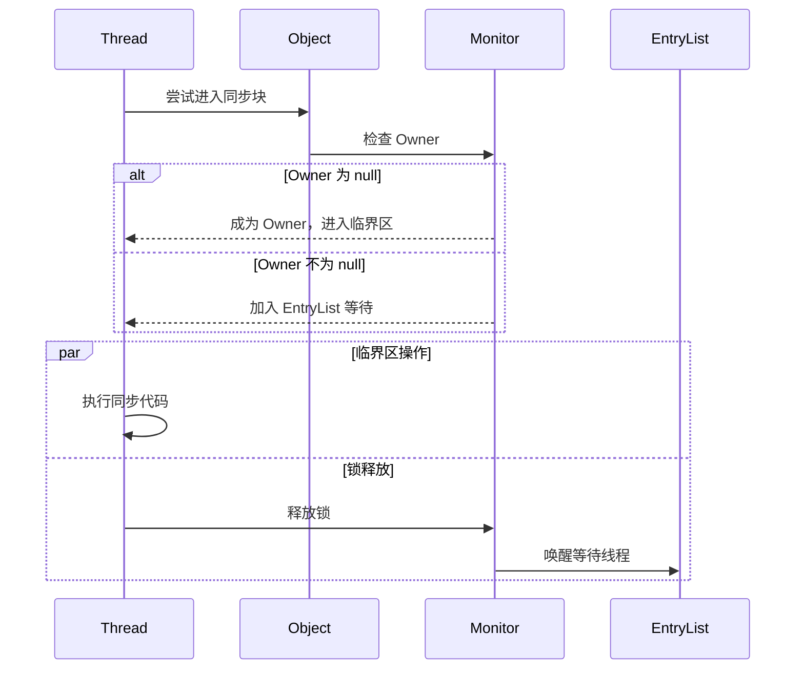

# 1 基本概念

**进程**是**资源分配**的**最小单位**，**线程**是**CPU调度**的**最小单位**。

# 2 线程创建

## 2.1 继承 Thread 类（重点）

1. 自定义线程类，**继承Thread类**
2. 重写run()方法，编写线程执行体
3. 在主函数中创建一个线程对象，调用start()方法开启线程。

```java
public class TestThread extends Thread {
    @Override
    public void run() {
        //run方法线程方法体
        for (int i = 0; i < 20; i++) {
            System.out.println("我在看代码----" + i);
        }
    }
    public static void main(String[] args) {
        //创建一个线程对象
        TestThread testThread = new TestThread();
		//start开启线程
        testThread.start();
        //主线程
        for (int i = 0; i < 200; i++) {
            System.out.println("我在学习多线程-----" + i);
        }
    }
}
```

## 2.2 实现Runnable接口（重点）

1. 自定义线程类，**实现Runnable接口**
2. 重写run()方法，编写线程执行体
3. 执行线程需要丢入runnable接口实现类，调用start()方法。

```java
public class TestThread2 implements Runnable {
    @Override
    public void run() {
        //run方法线程方法体
        for (int i = 0; i < 20; i++) {
            System.out.println("我在看代码----" + i);
        }
    }
    public static void main(String[] args) {
        //创建一个线程对象
        TestThread2 testThread2 = new TestThread2();
        //创建线程对象，通过线程对象来开启线程，代理
        new Thread(testThread2).start();
        //主线程
        for (int i = 0; i < 200; i++) {
            System.out.println("我在学习多线程-----" + i);
        }
    }
}
```

以上两种方式的比较：

继承 Thread 类

- 子类继承 Thread 类具备多线程能力
- 启动线程：子类对象 .start()
- 不建议使用：**避免 OOP 单继承局限性**
- 实现 Runnable 接口

**实现接口 Runnable**

- 具有多线程能力
- 启动线程：传入目标对象 + Thread对象.start()
- 推荐使用：**避免单继承局限性，方便同一个对象被多个线程使用。**

## 2.3 实现Callable接口

实现Callable接口，重写call方法。

1. **实现 Callable 接口，需要返回值类型**：class TestCallable implements Callable<Boolean>{}
2. **重写 call 方法，需要抛出异常**：public Boolean call()
3. **创建目标对象**：TestCallable testThread1 =  new TestCallable()
4. **创建执行服务**：ExecutorService service = Executor.newFixedThreadPool(4);
5. **提交执行**：Future<Boolean> result = ser.submit(testThread1);
6. **获取结果**：boolean r = result.get();
7. **关闭服务**：service.shutdownNow():

```java
public class TestCallable implements Callable<Boolean> {
    private String url;  //网络历经
    private String name;  // 保存的文件名
    public TestCallable(String url, String name) {
        this.name = name;
        this.url = url;
    }
    //下载图片线程的执行体
    @Override
    public Boolean call() {
        WebDownloader webDownloader = new WebDownloader();
        webDownloader.downloader(url, name);
        System.out.println("下载了文件名为：" + name);
        return true;
    }
    public static void main(String[] args) throws ExecutionException, InterruptedException {
        TestCallable testThread1 = new TestCallable("https://img-blog.csdnimg.cn/20210531145950543.png", "2.png");
        TestCallable testThread2 = new TestCallable("https://img-blog.csdnimg.cn/20210531145950543.png", "3.png");
        TestCallable testThread3 = new TestCallable("https://img-blog.csdnimg.cn/20210531145950543.png", "4.png");
        TestCallable testThread4 = new TestCallable("https://img-blog.csdnimg.cn/20210531145950543.png", "5.png");
        //创建执行服务:
        ExecutorService service = Executors.newFixedThreadPool(4);
        //提交执行:
        Future<Boolean> r1 = service.submit(testThread1);
        Future<Boolean> r2 = service.submit(testThread2);
        Future<Boolean> r3 = service.submit(testThread3);
        Future<Boolean> r4 = service.submit(testThread4);
        // 获取结果:
        boolean rs1 = r1.get();
        boolean rs2 = r2.get();
        boolean rs3 = r3.get();
        boolean rs4 = r4.get();
        //关闭服务:
        service.shutdownNow();

    }
    class WebDownloader {
        //下载方法
        public void downloader(String url, String name) {
            try {
                FileUtils.copyURLToFile(new URL(url), new File(name));
            } catch (IOException e) {
                e.printStackTrace();
                System.out.println("IO异常，downler方法出现问题");
            }
        }
    }
}
```

## 2.4 静态代理模式

### 2.4.1 Java 中动态代理与静态代理的本质区别

#### 1. 代理类的生成时机与方式
- **静态代理**  
  ⚙️ **编译时生成**：需手动编写代理类代码，代理类与被代理类实现同一接口。  
  📝 **显式调用**：在代理类中直接硬编码调用目标对象的方法。

- **动态代理**  
  ⚡ **运行时生成**：通过 `Proxy` 类和 `InvocationHandler` 接口动态创建代理对象。  
  🧬 **反射机制**：无需手动编写代理类，由 JVM 在内存中生成字节码。

---

#### 2. 代码维护性与灵活性
| **特性**     | 静态代理                         | 动态代理                                 |
| ------------ | -------------------------------- | ---------------------------------------- |
| **代码冗余** | 高（需为每个方法重复代理逻辑）   | 低（通过 `Invoke` 方法统一处理所有调用） |
| **扩展性**   | 差（每新增一个类需创建新代理类） | 强（一个处理器可代理多个接口/类）        |
| **适用场景** | 简单场景或需要精确控制个别方法   | AOP、日志、事务等横切关注点场景          |

---

#### 3. 接口依赖与实现方式
- **静态代理**  
  🔌 **支持两种模式**：  
  - 基于接口：代理类和目标类实现同一接口  
  - 基于继承：直接继承目标类（需覆写方法，但耦合度高）

- **动态代理（JDK 原生）**  
  🚫 **仅支持接口**：通过 `Proxy.newProxyInstance()` 代理接口方法。  
  💡 **第三方扩展**：CGLIB 库可通过继承方式代理无接口的类。

---

#### 4. 性能对比
| **维度**         | 静态代理               | 动态代理                 |
| ---------------- | ---------------------- | ------------------------ |
| **方法调用速度** | 快（直接调用无反射）   | 略慢（反射调用）         |
| **内存消耗**     | 低（编译时确定类结构） | 略高（运行时生成字节码） |
| **适用场景**     | 高性能敏感场景         | 灵活性与可维护性优先场景 |

---

### 2.4.2 代码示例对比

#### 静态代理实现
```java
// 接口
interface Database {
    void query(String sql);
}
// 目标类
class MySQL implements Database {
    public void query(String sql) {
        System.out.println("Executing: " + sql);
    }
}
// 静态代理类
class LogProxy implements Database {
    private MySQL mysql;    
    public LogProxy(MySQL mysql) {
        this.mysql = mysql;
    }    
    public void query(String sql) {
        System.out.println("[LOG] Start query: " + sql); // 手动添加日志
        mysql.query(sql);
        System.out.println("[LOG] End query");
    }
}
```

#### 动态代理实现

```java
import java.lang.reflect.*;

class LogHandler implements InvocationHandler {
    private Object target;    
    public LogHandler(Object target) {
        this.target = target;
    }    
    public Object invoke(Object proxy, Method method, Object[] args) throws Throwable {
        System.out.println("[LOG] Start method: " + method.getName());
        Object result = method.invoke(target, args); // 统一拦截所有方法
        System.out.println("[LOG] End method");
        return result;
    }
}
// 使用动态代理
Database mysql = new MySQL();
Database proxy = (Database) Proxy.newProxyInstance(
    mysql.getClass().getClassLoader(),
    new Class[]{Database.class},
    new LogHandler(mysql)
);
proxy.query("SELECT * FROM users");
```

### 2.4.3 本质区别总结

| **核心差异**     | 静态代理                 | 动态代理                       |
| :--------------- | :----------------------- | :----------------------------- |
| **设计哲学**     | 代码即约定（显式硬编码） | 运行时可编程（动态字节码增强） |
| **实现范式**     | 面向具体实现             | 面向抽象拦截                   |
| **设计模式演进** | 代理模式的传统实现       | 反射机制 + 代理模式的结合创新  |

# 3 多线程（重点）

## 3.1 线程状态及转换

线程的六种状态及转化

`java.lang.Thread.State`枚举类中定义了六种线程的状态，可以调用线程Thread中的`getState()`方法**获取当前线程的状态**。

| 线程状态      | 解释                                                         |
| :------------ | :----------------------------------------------------------- |
| NEW           | 尚未启动的线程状态，即线程创建，**还未调用start方法**        |
| RUNNABLE      | **就绪状态**（调用start，等待调度）+**正在运行**             |
| BLOCKED       | **等待监视器锁**时，陷入阻塞状态                             |
| WAITING       | 等待状态的线程正在**等待**另一线程执行特定的操作（如notify） |
| TIMED_WAITING | 具有**指定等待时间**的等待状态                               |
| TERMINATED    | 线程完成执行，**终止状态**                                   |


### 3.1.1 新建状态 (NEW)

即用**new关键字**新建一个线程，这个线程就处于**新建状态**。

### 3.1.2 运行状态 (RUNNABLE)

- 就绪状态（READY)

  java中**就绪和运行状态统一称为运行态**。当线程**调用 start() 方法**，线程就处于就绪态，此时**JVM中线程调度器**可以执行该线程。

  - 线程执行完成之后进入终止状态，所以不能再次使用start。

- 其他状态到运行状态

  - 线程调用start()，新建状态转化为就绪状态。
  - 线程sleep(long)时间到，等待状态转化为就绪状态。
  - 阻塞式IO操作结果返回，线程变为就绪状态。
  - 其他线程调用join()方法（**join方法保证线程有序执行**），结束之后转化为就绪状态。
  - 线程对象拿到对象锁之后，也会进入就绪状态。

- 运行状态 (RUNNING)

  就绪态线程获得CPU之后，便可以**执行run()方法**，此时处于运行状态。

- 运行状态转变为就绪状态

  - 线程失去处理器资源。
  - 调用yield()静态方法，当前线程愿意放弃当前对处理器的使用。这时，**当前线程将会被置为就绪状态**，和其他线程一样等待调度，这时候根据不同**优先级**决定的**概率**，当前线程完全有**可能再次抢到处理器资源**。

### 3.1.3 阻塞状态 (BLOCKED)

阻塞状态表示线程**正等待监视器锁**，而陷入的状态。

以下场景线程将会阻塞：

- 线程等待进入synchronized同步方法。
- 线程等待进入synchronized同步代码块。

线程取得锁，就会从阻塞状态转变为就绪状态。

### 3.1.4 等待状态 (WAITING)

进入该状态表示**当前线程需要等待其他线程做出一些的特定的动作**（通知或中断）。

**运行->等待**

- 当前线程运行过程中，其他线程调用`join`方法，当前线程将会进入等待状态。
- 当前线程对象调用`wait()`方法。
  -`LockSupport.park()`：出于线程调度的目的**禁用当前线程**。

**等待->就绪**

- 等待的线程**被其他线程对象唤醒**，`notify()`和`notifyAll()`。
- `LockSupport.unpark(Thread)`，与上面park方法对应，给出许可证，**解除等待状态**。

### 3.1.5 超时等待状态 (TIMED_WAITING)

区别于`WAITING`，它可以在**指定的时间**自行返回。

**运行->超时等待** 

- 调用静态方法，`Thread.sleep(long)`
- 线程对象调用`wait(long)`方法
- 其他线程调用指定时间的`join(long)`。
- `LockSupport.parkNanos()`。
- `LockSupport.parkUntil()`。

sleep和yield的不同之处：

- sleep(long)方法会**使线程转入超时等待状态**，时间到了之后才会转入就绪状态。而yield()方法不会将线程转入等待，而是强制线程进入就绪状态。
- 使用sleep(long)方法**需要处理异常**，而yield()不用。

**超时等待->就绪** 

- 同样的，等待的线程被其他线程对象唤醒，`notify()`和`notifyAll()`。
- `LockSupport.unpark(Thread)`。

### 3.1.6 终止状态 (TERMINATED)

即**线程的终止**，表示线程已经执行完毕。

## 3.2 守护线程（Daemon Threads）

守护线程（Daemon Thread）是Java中一种特殊的线程，主要用于**执行一些辅助任务**，如**垃圾回收、缓存管理等**。与普通线程（非守护线程）相比，守**护线程的特点是它会在所有非守护线程结束后自动关闭**。这意味着当应用程序中没有非守护线程在运行时，**JVM会自动关闭所有守护线程**。

```java
Thread daemonThread = new Thread(() -> {
    // 守护线程的代码逻辑
});
daemonThread.setDaemon(true);
daemonThread.start();
```

# 4 线程同步（重点）

线程同步指的是**线程之间“协同”**，即线程之间按照规定的先后次序运行。

经典的**超卖问题**和取款的**脏读问题**。

## 4.1 *synchronized* 同步方法以及同步块

Synchronized 是常被我们用来保证临界区以及临界资源安全的解决方案。它可以保证当有多个线程访问同一段代码，操作共享数据时，其他线程必须等待正在操作线程完成数据处理后再进行访问。即 Synchronized 可以达到线程互斥访问的目的。

Synchronized锁代表的锁机制有如下两种特性：互斥型和可见性。

- 互斥性：同一时间只允许一个线程持有某个对象锁，通过这种特性来实现多线程中并发安全；
- 可见性：确保锁在释放之前所做的操作，对之后的其他线程是可见的（即之后获取到该锁的线程获取到的共享变量是最新的）。



### 4.1.1 Synchronized对应的锁对象（重点）

理论上Java中所有的对象都可以作为锁，Java中根据synchronized使用的场景不同，其锁对象也是不一样的。

| 场景       | 具体分类 | 锁对象            | 代码示例                                          |
| ---------- | -------- | ----------------- | ------------------------------------------------- |
| 修饰方法   | 实例方法 | 当前实例对象      | public synchronized void method () { ... }        |
| 修饰方法   | 静态方法 | 当前类的Class对象 | public static synchronized void method () { ... } |
| 修饰代码块 | 代码块   | `( )`中配置的对象 | synchronized(object) { ... }                      |

在Java在JVM内存模型的堆中存储对象，每个对象都会存在对象头，对象头有**Mark Word 标记位**（分代年龄、锁状态、hashcode）和 **class pointer**（指向类元数据地址）。

当程序执行到同步代码块或者同步方法的时候，首先会去判断锁的状态，执行锁升级的流程。

（这里仅仅介绍重量锁）当遇到锁竞争激烈的时候，轻量锁会升级称为重量锁，每个对象都有可能会关联一个Monitor（因为Monitor是懒加载的，只有当锁升级为重量锁的时候才会创建Monitor）。在重量级锁状态下，Mark Word 的指针指向的是 Monitor 对象（ObjectMonitor），但具体位数与 JVM 实现相关（如 64 位系统会复用部分位）。

此时线程A访问同步代码块，通过对象头的 Monitor 指针找到关联的 ObjectMonitor，尝试通过 CAS 将 `owner` 字段设置为当前线程。失败则进入 EntryList 等待。

若当前线程已是 `owner`，`recursions++`，进行锁重入。

执行完毕后，退出同步块时，`recursions--`。当 `recursions == 0` 时，`owner` 置空，唤醒 EntryList 中的线程。

### 4.1.2 Monitor机制与Java对象头

#### 1 Monitor 是什么？

- 每个 Java 对象都关联一个 Monitor（管程/监视器）

- 实现线程互斥的核心机制

- 包含三个关键部分：

  | Owner         | 当前持有锁的线程           |
  | ------------- | -------------------------- |
  | **EntryList** | **等待锁的线程队列**       |
  | **WaitSet**   | **调用 wait() 的线程队列** |

#### 2 对象头与锁标记

```java
Object o = new Object();
synchronized(o) { /*...*/ } // 这里会修改 o 的对象头
```

- 对象内存结构：

  ```markdown
  |------------------------|------------------|----------------|
  |      Mark Word         |   Class Pointer  |  Instance Data |
  |------------------------|------------------|----------------|
  ```

- Mark Word 结构（64位系统）：

  

### 4.1.3 JVM 层面的实现

#### 1 字节码层面

查看编译后的字节码：

```
public void test();
  Code:
     0: aload_0
     1: getfield      #3  // 获取对象引用
     4: dup
     5: astore_1
     6: monitorenter   // 进入监视器
     7: aload_1
     8: monitorexit    // 正常退出
     9: goto  17
    12: astore_2
    13: aload_1
    14: monitorexit    // 异常退出
    15: aload_2
    16: athrow
    17: return
```

#### 2 锁升级过程



#### 3 不同锁状态的对比：

| 锁状态   | 优点             | 缺点            | 适用场景         |
| :------- | :--------------- | :-------------- | :--------------- |
| 偏向锁   | 加解锁无额外消耗 | 存在撤销开销    | 单线程访问       |
| 轻量级锁 | 线程交替执行     | 自旋消耗CPU     | 低竞争           |
| 重量级锁 | 不消耗CPU        | 线程阻塞/唤醒慢 | 高竞争、长临界区 |

### 4.1.4 Monitor 工作原理



#### 1 获取锁流程

1. 当线程执行到同步代码块
2. 检查 Owner 字段：
   - 为空：成为 Owner，进入临界区
   - 非空（不等于self）：进入 EntryList 等待

#### 2 释放锁流程

1. 将 Owner 置为 null
2. 唤醒 EntryList 中的线程（非公平竞争）

#### 3 wait/notify 机制


```java
synchronized(obj) {
    obj.wait();  // 进入 WaitSet
    obj.notify();// 随机唤醒一个 WaitSet 中的线程
}
```

### 4.1.5 重要特性解析

#### 1 可重入性

```java
public synchronized void a() {
    b(); // 可重入
}
public synchronized void b() {
    // 无需重新获取锁
}
```

- 实现原理：Monitor 中维护计数器（每次进入+1，退出-1）

#### 2 内存可见性

- 遵循 happens-before 原则
- 解锁前修改对后续加锁线程可见